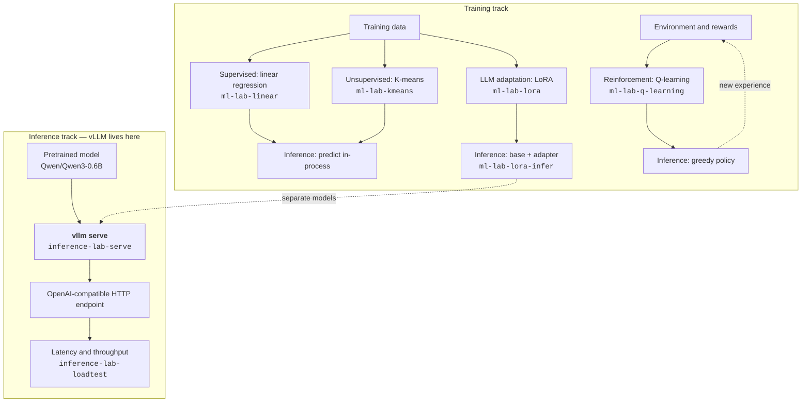

# ML Training and Inference Labs

A beginner-friendly, hands-on guide to training small machine-learning models
and running, measuring, and tuning real large language model (LLM) inference.
The training path begins with algorithms small enough to understand line by
line, then progresses to real LoRA language-model fine-tuning. The inference
path works with Apple Silicon through Metal and MLX, or with NVIDIA hardware
through CUDA.

The project favors small, reproducible experiments. Start with conservative
settings, change one variable at a time, and record the hardware and software
versions with every result.

## The complete learning path



**Where vLLM is:** the entire second box. Nothing in the training track uses it.
`inference-lab-serve` does not serve anything itself — it detects your hardware,
builds a `vllm serve ...` command line, prints it, and runs it.

**The dotted line is deliberate.** The LoRA adapter you train is *not* fed into
vLLM. The tracks adapt and serve different models — LoRA uses
`SmolLM2-135M-Instruct`, vLLM serves `Qwen/Qwen3-0.6B` — and `inference_labs/`
contains no adapter-loading code at all. The connection is conceptual: you learn
what a trained model is, then learn how one is served. Serving your own adapter
through vLLM is a genuine next step, not something this repo already does.

- **Linear regression** learns to predict a number from labeled examples.
- **K-means** discovers groups without target labels.
- **Q-learning** learns which action to take from rewards rather than a fixed
  table of correct answers. Its training and inference rules genuinely differ:
  training explores at random some of the time, inference never does.
- **LoRA** fine-tunes a small part of a pretrained language model.
- **vLLM** serves a language model efficiently, with the batching and cache
  behavior that only autoregressive generation demands.

Every lab has an inference step — a trained model producing an answer from new
input. Only the language model gets *served*: exposed over HTTP under
concurrency. That is a scope choice. Linear regression is a dot product and
Q-learning is a table lookup, so serving them would exercise a web framework
rather than teach anything about batching, KV-cache pressure, or tail latency.

## The inference path

```text
                         inference-lab-serve
                                  |
                          detect hardware
                       /          |          \
              Apple Silicon   NVIDIA GPU   no accelerator
                   |               |              |
             vLLM-Metal       vLLM + CUDA    explain options
             (MLX backend)                      or test mock
                   \               /
                    OpenAI-compatible API
                              |
                    same client and load tests
                              |
              latency, TTFT, ITL, throughput, errors
```

`TTFT` means **time to first token**. `ITL` means **inter-token latency**, the
delay between generated tokens. `API` means **application programming
interface**. The [glossary](docs/07-glossary.md) expands the other acronyms.

Imagine you ask an AI to write a short story. You click "Send" at exactly 0.0 seconds.

TTFT (Time to First Token)
- The Action: The screen is blank while the server thinks.
- The Moment: At 1.5 seconds, the very first word "Once" pops up.
- The Value: Your TTFT is 1.5 seconds.

ITL (Inter-Token Latency)
- The Action: The rest of the sentence starts streaming out.
- The Moment:
  - "Once" appears at 1.50 seconds.
  - "upon" appears at 1.53 seconds (0.03s delay).
  - "a" appears at 1.56 seconds (0.03s delay).
  - "time" appears at 1.59 seconds (0.03s delay).
- The Value: Your ITL is 30 milliseconds (0.03 seconds) per token.

## What you will learn

- The difference among supervised, unsupervised, and reinforcement learning.
- How features, labels, loss, gradient descent, epochs, and hyperparameters fit
  together.
- How K-means alternates between assigning points and moving cluster centers.
- How an agent uses exploration, rewards, and Q-values to learn a policy.
- How Low-Rank Adaptation (LoRA) fine-tunes a small fraction of an LLM's
  parameters and saves a compact adapter.
- How to separate training, evaluation, and inference.
- How a prompt becomes tokens and then generated output.
- Why inference has a **prefill** phase and a **decode** phase.
- How vLLM differs from writing model code directly in PyTorch or JAX.
- How continuous batching and the key-value (KV) cache improve serving.
- How quantization reduces memory use, and what accuracy/performance tradeoffs
  it can introduce.
- How to measure p50, p95, and p99 latency rather than relying on one fast run.
- How to tune for latency or throughput without changing several variables at
  once.
- How to run the same HTTP workload against Apple Metal or NVIDIA CUDA.

## Repository map

```text
configs/                 portable serving profiles
data/                    tiny, inspectable training datasets
deploy/nvidia/           optional Kubernetes deployment for NVIDIA clusters
docs/                    the study guide
inference_labs/          hardware detection, serving, metrics, and load tests
labs/                    small PyTorch and JAX framework experiments
training_labs/           regression, clustering, Q-learning, and LoRA code
tests/                   deterministic tests; the mock server lives here in spirit
RESULTS.md               experiment worksheet
```

## What each file teaches

Every source file is written to be read. The comments explain the concepts from
first principles, with worked examples and diagrams, and assume no machine-learning
background. Reading the code is part of the course, not a detour from it.

### Training path

| File | Concepts it teaches | Guide |
|---|---|---|
| `training_labs/linear_regression.py` | Features and labels; mean squared error and why errors are squared; gradient descent as walking downhill; learning rate and epochs; why inputs are normalized; train/test split and overfitting; RMSE versus MSE units | [docs/09](docs/09-linear-regression.md) |
| `training_labs/kmeans.py` | Learning without labels; the assign/move cycle; why starting positions matter and how k-means++ spreads them; inertia and why it cannot choose `k`; silhouette score, which can choose `k` | [docs/10](docs/10-kmeans.md) |
| `training_labs/q_learning.py` | Learning from rewards instead of answers; the Q-table as a literal table; explore versus exploit and epsilon decay; the Q-learning update rule term by term; how reward spreads backward from the goal | [docs/11](docs/11-reinforcement-learning.md) |
| `training_labs/lora_finetune.py` | Why full fine-tuning is expensive; the frozen base model and the low-rank detour; rank, alpha, and dropout; tokenization; how next-token training works; gradient accumulation | [docs/12](docs/12-lora-finetuning.md) |
| `training_labs/lora_inference.py` | Why an adapter is not a model; loading base plus adapter; greedy decoding, and why determinism matters when comparing before and after | [docs/12](docs/12-lora-finetuning.md) |

### Inference path

| File | Concepts it teaches | Guide |
|---|---|---|
| `inference_labs/hardware.py` | What an accelerator backend is; detecting Apple Metal versus NVIDIA CUDA; why presence of a GPU is not the same as a usable one | [docs/00](docs/00-installation.md) |
| `inference_labs/serve.py` | What a serving engine does; how tuning settings layer from shared defaults to backend to profile; why the exact command is printed rather than hidden | [docs/02](docs/02-vllm-architecture.md), [docs/03](docs/03-tuning.md) |
| `inference_labs/metrics.py` | Why averages hide bad experiences; percentiles and how p50, p95, and p99 are computed; reading tail latency | [docs/05](docs/05-measurement.md) |
| `inference_labs/loadtest.py` | Time to first token versus total latency; what concurrency simulates; how streamed responses arrive over the wire; turning measurements into pass/fail thresholds | [docs/05](docs/05-measurement.md) |
| `inference_labs/mock_server.py` | The shape of an OpenAI-compatible API; server-sent event streaming; why a fake server is useful for tests and useless for benchmarks | [docs/01](docs/01-inference-basics.md) |
| `inference_labs/doctor.py` | The setup problems that break GPU inference, and how to spot them before a long startup fails | [docs/06](docs/06-troubleshooting.md) |
| `inference_labs/demo.py` | The full measurement loop end to end, with no GPU or model download required | [docs/05](docs/05-measurement.md) |

### Framework comparison

| File | Concepts it teaches | Guide |
|---|---|---|
| `labs/pytorch_inference.py` | Why batching raises throughput far faster than it raises latency; why warmup runs and GPU synchronization are required to time anything honestly | [docs/04](docs/04-pytorch-jax-vllm.md) |
| `labs/jax_inference.py` | The same batching result in a different framework; `vmap` and `jit`; how JAX's compile-first model differs from PyTorch's run-as-you-go one | [docs/04](docs/04-pytorch-jax-vllm.md) |

## Start here: training labs

Install the base project. The first three labs have no third-party runtime
dependencies:

```bash
cd ml-training-inference-labs
uv sync
source .venv/bin/activate
python -m unittest discover -s tests -v
```

Run each lab:

```bash
# Supervised learning: predict house prices from labeled examples.
ml-lab-linear

# Unsupervised learning: group customers without target labels.
ml-lab-kmeans --clusters 3

# Reinforcement learning: learn a path through a grid from rewards.
ml-lab-q-learning --episodes 2000
```

The datasets are intentionally tiny so you can open them and understand every
row. After those labs, try [popular public datasets](docs/13-datasets.md).

### Fine-tune a small LLM with LoRA

LoRA is an optional lab because it downloads PyTorch, Hugging Face libraries,
and the `HuggingFaceTB/SmolLM2-135M-Instruct` base model:

```bash
uv sync --extra lora
source .venv/bin/activate

# Verify arguments and hardware detection without downloading the model.
ml-lab-lora --dry-run

# Run a deliberately short real fine-tuning exercise.
ml-lab-lora --steps 20 --max-examples 24

# Load the saved adapter and generate text.
ml-lab-lora-infer --prompt "Explain the difference between training and inference."
```

The default automatically prefers an NVIDIA CUDA GPU, then Apple Metal
Performance Shaders (MPS), then the CPU. A Mac can run this small exercise, but
an NVIDIA GPU is normally faster. Read the complete [LoRA guide](docs/12-lora-finetuning.md)
before increasing model size, sequence length, examples, or steps.

To remove only the LoRA outputs and downloaded base model later:

```bash
rm -rf "artifacts/lora-adapter"
rm -rf "$HOME/.cache/huggingface/hub/models--HuggingFaceTB--SmolLM2-135M-Instruct"

# Return this project's environment to its small base dependency set.
uv sync
```

## Continue with inference serving

1. Read [installation and setup](docs/00-installation.md).
2. Install this project with `uv`:

   ```bash
   uv sync
   source .venv/bin/activate
   python -m unittest discover -s tests -v
   inference-lab-doctor
   ```

3. Install the platform-specific vLLM runtime:

   - Apple Silicon: follow [Complete Apple Silicon setup and run](#complete-apple-silicon-setup-and-run)
     below. It uses the official vLLM-Metal installer.
   - NVIDIA: follow [installation](docs/00-installation.md#nvidia-cuda).

4. Preview what will run:

   ```bash
   inference-lab-serve --dry-run
   ```

5. Start real inference using automatic hardware detection:

   ```bash
   inference-lab-serve --profile learning
   ```

6. In a second terminal, run a streaming load test:

   ```bash
   source .venv/bin/activate
   inference-lab-loadtest \
     --base-url http://127.0.0.1:8000 \
     --model Qwen/Qwen3-0.6B \
     --requests 40 \
     --concurrency 4 \
     --max-tokens 64 \
     --stream
   ```

## Complete Apple Silicon setup and run

`vllm-project/vllm-metal` is a public repository owned by the same GitHub
organization as vLLM. For a beginner who wants to run inference rather than
change vLLM-Metal itself, use its official installer directly. It checks for
Apple Silicon, creates an isolated environment at `~/.venv-vllm-metal`, and
installs prebuilt vLLM and vLLM-Metal wheels. It does not leave a source-code
checkout on your Mac.

### Install

```bash
# Install vLLM-Metal using the official upstream installer.
curl -fsSL https://raw.githubusercontent.com/vllm-project/vllm-metal/main/install.sh | bash

# Activate the isolated environment whenever you want to use vLLM-Metal.
source ~/.venv-vllm-metal/bin/activate

# Confirm that installation succeeded.
vllm --version
```

The installer also installs `uv` if it is not already available. The virtual
environment and its Python packages occupy disk space even though no source
repository was cloned.

### Run a small model

Start a small, supported model and listen only on your Mac:

```bash
source ~/.venv-vllm-metal/bin/activate

vllm serve Qwen/Qwen3-0.6B \
  --host 127.0.0.1 \
  --port 8000 \
  --generation-config vllm \
  --max-model-len 4096 \
  --max-num-seqs 16 \
  --enable-prefix-caching
```

Keep that terminal open. In a second terminal:

```bash
cd ml-training-inference-labs
uv sync
source .venv/bin/activate

curl -fsS http://127.0.0.1:8000/health
curl -fsS http://127.0.0.1:8000/v1/models

inference-lab-loadtest \
  --base-url http://127.0.0.1:8000 \
  --model Qwen/Qwen3-0.6B \
  --requests 40 \
  --concurrency 4 \
  --max-tokens 64 \
  --stream
```

Press `Control-C` in the server terminal to stop the server. Later, reactivate
the runtime with:

```bash
source ~/.venv-vllm-metal/bin/activate
```

On its first run, vLLM downloads the model from Hugging Face. The model is
normally cached under `~/.cache/huggingface/hub`, so later starts do not need to
download it again.

### Uninstall vLLM-Metal

First stop the server with `Control-C`. Then remove only the isolated runtime:

```bash
deactivate 2>/dev/null || true
rm -rf "$HOME/.venv-vllm-metal"
```

This does not remove downloaded models. It also does not remove `uv`, because
another Python project may use it.

### Remove the sample model

Check the model's disk usage, then delete only this lab's sample model:

```bash
du -sh "$HOME/.cache/huggingface/hub/models--Qwen--Qwen3-0.6B" 2>/dev/null
rm -rf "$HOME/.cache/huggingface/hub/models--Qwen--Qwen3-0.6B"
```

Do not delete the entire `~/.cache/huggingface` directory unless you intend to
remove models and datasets used by every Hugging Face project on your account.

### What the commands mean

- `curl` downloads the official installer; the pipe sends it to `bash` to run.
- `source ~/.venv-vllm-metal/bin/activate` selects the isolated vLLM-Metal
  Python environment for the current terminal.
- `vllm serve ...` starts the inference server and downloads the named model if
  it is not already cached.
- `Control-C` stops the server; `deactivate` leaves the Python environment.

Running a model can use substantial unified memory, power, and battery. The
first start is slower because it downloads and initializes the weights. Not
every CUDA vLLM feature or model is available through vLLM-Metal yet.

Automatic detection is only a default. Override it when necessary:

```bash
inference-lab-serve --backend metal --profile learning
inference-lab-serve --backend cuda --profile throughput
INFERENCE_BACKEND=cuda inference-lab-serve --dry-run
```

The program prints the selected backend and exact command. This matters because
hardware detection can be misleading inside containers or remote environments.

## What happens during one request?

```text
prompt text
    |
    v
tokenizer ---> token IDs ---> PREFILL ---> KV cache
                                  |           |
                                  +-----------+
                                       |
                                  DECODE loop
                          one next token at a time
                                       |
                                       v
                             streamed output text
```

- **Tokenization** converts text into integer token identifiers.
- **Prefill** processes all prompt tokens, usually as a large parallel matrix
  computation. Long prompts mostly affect time to first token.
- The **KV cache** stores attention keys and values that would otherwise be
  recomputed for every new output token.
- **Decode** produces one token per sequence per step. It is frequently limited
  by memory movement rather than raw arithmetic.

Continue with [inference fundamentals](docs/01-inference-basics.md) and
[vLLM architecture](docs/02-vllm-architecture.md).

## Portable profiles

The profiles in `configs/serve.toml` make the tuning choices visible:

| Profile | Goal | Important choices |
|---|---|---|
| `learning` | Safe first run | Shorter context, low concurrency |
| `latency` | Smoother token delivery | Smaller batched-token budget |
| `throughput` | More total work per second | More sequences and batched tokens |

Example:

```bash
inference-lab-serve --profile latency
inference-lab-serve --profile throughput
```

Do not conclude that one profile is universally better. Test the same model,
prompt lengths, output lengths, and arrival pattern. See the complete
[optimization guide](docs/03-tuning.md).

## Do you need an NVIDIA machine?

No, not to begin. Apple Silicon with vLLM-Metal runs real model inference and
is enough to learn the API, token flow, batching, caching, streaming, and
measurement workflow.

Use an NVIDIA machine when you want to study CUDA-specific behavior, compare
Metal and CUDA, use an NVIDIA-only optimization, or try the Kubernetes example.
Cloud GPU resources cost money while allocated. Check the live price and quota
before creating anything, use the smallest suitable GPU, and remove resources
when finished.

Five providers are described below. Any of them will do; they differ mainly in
how much setup stands between you and a shell prompt.

| Option | Provider | Good for | Watch out for |
|---|---|---|---|
| A | AWS EC2 | A familiar starting point with prebuilt GPU images | Terminate, do not just disconnect |
| B | CoreWeave | The Kubernetes path and `deploy/nvidia/vllm.yaml` | More moving parts than a single VM |
| C | Google Cloud | Fastest single-VM setup; current L4 inference GPUs | GPU quota often starts at zero |
| D | Azure | Wide single-GPU size choice | Quota is per region *and* per VM family |
| E | OCI | Competitive GPU pricing | GPU access needs manual approval first |

Every option converges on the same
[post-provisioning steps](#once-the-machine-is-running), so only the
provisioning part differs.

### Option A: AWS EC2

AWS recommends starting GPU workloads with a **Deep Learning Amazon Machine
Image (DLAMI)**, which includes NVIDIA drivers and CUDA libraries.

1. Open the Amazon EC2 console and select the intended region.
2. Choose **Launch instance**.
3. Select a current Ubuntu Deep Learning Base or Deep Learning OSS NVIDIA
   Driver GPU AMI. Avoid obsolete operating-system releases.
4. Select a single-GPU accelerated-computing instance. A small model such as
   Qwen3-0.6B does not require a multi-GPU P-series system. Availability, quota,
   and prices vary by region, so inspect them before launch.
5. Restrict inbound SSH to your IP address; do not expose port 8000 publicly.
6. Connect with SSH and verify:

   ```bash
   nvidia-smi
   ```

7. Clone this repository and follow the NVIDIA installation instructions.
8. When finished, **terminate** the instance if you no longer need its disk.
   Merely disconnecting SSH does not stop billing.

Official references:

- https://docs.aws.amazon.com/dlami/latest/devguide/launch.html
- https://docs.aws.amazon.com/AWSEC2/latest/UserGuide/gpu-instances-started.html
- https://docs.aws.amazon.com/dlami/latest/devguide/setup.html

### Option B: CoreWeave

CoreWeave offers managed inference and CoreWeave Kubernetes Service (CKS).
For this lab, CKS is the relevant self-managed path because it lets you deploy
and tune the vLLM server yourself.

1. Create a CoreWeave account and confirm that your account has access to CKS
   and on-demand GPU capacity.
2. In the Cloud Console, create a CKS cluster.
3. After the cluster becomes healthy, add a GPU Node Pool. A Node Pool is a
   group of machines with the same hardware configuration.
4. Download the cluster credentials and verify access with `kubectl get nodes`.
5. Review `deploy/nvidia/vllm.yaml`, set the model and resource requests, then
   perform a server-side dry run before applying it.
6. Follow CoreWeave's vLLM tutorial for storage, monitoring, GPU metrics, and
   autoscaling rather than treating the small manifest here as a complete
   production deployment.
7. Delete the workload and GPU Node Pool when the experiment is complete.

Official references:

- https://docs.coreweave.com/products/cks/clusters/create
- https://docs.coreweave.com/products/inference/cks
- https://docs.coreweave.com/products/cks/tutorials/deploy-vllm-inference/2-set-up-monitoring

CoreWeave also offers Dedicated Inference, which manages deployment, scaling,
and routing. That is useful for consuming an endpoint, but it hides some of the
server configuration this lab is designed to expose.

### Option C: Google Cloud (Compute Engine)

Google Cloud attaches GPUs either as accelerators on a general-purpose machine
type or as part of a purpose-built accelerator family. For this lab a single
L4 is a good fit: it is a current-generation inference GPU, and `g2-standard-4`
is the smallest shape that carries one.

1. Create or select a project and enable the Compute Engine API.
2. Request GPU quota **before** trying to launch anything. New projects
   frequently have a limit of zero. In the console open **IAM & Admin >
   Quotas & System Limits**, filter for `GPUs (all regions)` and for the
   per-region limit of the GPU you want, then submit an increase request.
   Approval is not always instant, so do this first.
3. Choose a region and zone that actually offers the GPU. Availability varies
   considerably between zones within the same region.
4. Pick a Deep Learning VM image family. These carry NVIDIA drivers and CUDA
   preinstalled; starting from a bare Ubuntu image means installing drivers
   yourself, which is the most common way this step goes wrong. The families
   are rotated as CUDA versions advance, so list them rather than trusting a
   name copied from any guide, this one included:

   ```bash
   gcloud compute images list \
     --project deeplearning-platform-release \
     --format="value(FAMILY)" --no-standard-images | sort -u
   ```

   Names follow `FRAMEWORK-CUDAVERSION-OS`. At the time of writing
   `common-cu129-ubuntu-2204-nvidia-580` is current.
5. Create the instance. Either machine shape below works:

   ```bash
   # One NVIDIA L4 on the G2 accelerator family.
   gcloud compute instances create vllm-lab \
     --zone=us-central1-a \
     --machine-type=g2-standard-4 \
     --image-family=common-cu129-ubuntu-2204-nvidia-580 \
     --image-project=deeplearning-platform-release \
     --boot-disk-size=200GB \
     --maintenance-policy=TERMINATE

   # Alternative: one NVIDIA T4 attached to a general-purpose N1 machine.
   gcloud compute instances create vllm-lab \
     --zone=us-central1-a \
     --machine-type=n1-standard-4 \
     --accelerator=type=nvidia-tesla-t4,count=1 \
     --image-family=common-cu129-ubuntu-2204-nvidia-580 \
     --image-project=deeplearning-platform-release \
     --boot-disk-size=200GB \
     --maintenance-policy=TERMINATE
   ```

   `--maintenance-policy=TERMINATE` is required: GPU instances cannot be live
   migrated during host maintenance.
6. Connect and confirm the driver is working:

   ```bash
   gcloud compute ssh vllm-lab --zone=us-central1-a
   nvidia-smi
   ```

   On first login the image may offer to finish installing the driver. Accept,
   then re-run `nvidia-smi` before continuing.
7. Follow [Once the machine is running](#once-the-machine-is-running) below.
8. When finished, delete the instance. Stopping it halts compute charges but
   the boot disk keeps billing:

   ```bash
   gcloud compute instances delete vllm-lab --zone=us-central1-a
   ```

Official references:

- https://docs.cloud.google.com/compute/docs/gpus
- https://docs.cloud.google.com/compute/docs/gpus/create-vm-with-gpus
- https://docs.cloud.google.com/compute/docs/gpus/install-drivers-gpu
- https://docs.cloud.google.com/compute/resource-usage

### Option D: Microsoft Azure (Virtual Machines)

Azure groups GPU machines into families: **NC** for compute, **ND** for large
multi-GPU training, and **NV** for visualization. Pick from the NC family.
ND sizes are far larger than this lab needs, and NV sizes are aimed at virtual
desktops — Azure ships them GRID drivers rather than the CUDA drivers a
compute workload wants. `Standard_NC4as_T4_v3` (one T4) is the smallest
sensible choice; `NC_A100_v4` and `NCads_H100_v5` are the larger steps up.

1. Create or select a resource group. Grouping everything in one resource group
   matters here, because deleting that group is the reliable way to remove
   every resource the experiment created.
2. Request quota **before** launching. Azure quota is per region *and* per VM
   family, so approval for one family grants nothing for another. In the portal
   open **Quotas > Compute**, filter to your region and the family you intend to
   use, and request an increase.
3. Create the VM. The NVIDIA GPU-optimized image carries the drivers:

   ```bash
   az group create --name vllm-lab-rg --location eastus

   az vm create \
     --resource-group vllm-lab-rg \
     --name vllm-lab \
     --size Standard_NC4as_T4_v3 \
     --image Canonical:ubuntu-24_04-lts:server:latest \
     --os-disk-size-gb 200 \
     --admin-username azureuser \
     --generate-ssh-keys
   ```

4. Install the GPU driver. The plain Ubuntu image above does not include one.
   The NVIDIA GPU Driver Extension installs the right CUDA driver for the size
   you chose, which is more reliable than installing by hand:

   ```bash
   az vm extension set \
     --resource-group vllm-lab-rg \
     --vm-name vllm-lab \
     --name NvidiaGpuDriverLinux \
     --publisher Microsoft.HpcCompute
   ```

   Omitting `--version` takes the current release. Check the extension
   documentation below for the operating systems it supports before choosing a
   different base image.

5. Connect and verify. `az vm create` opens SSH from any address by default,
   so restrict it to your own IP:

   ```bash
   az vm open-port --resource-group vllm-lab-rg --name vllm-lab \
     --port 22 --source-address-prefixes "$(curl -fsS https://api.ipify.org)/32"

   ssh azureuser@$(az vm show -d -g vllm-lab-rg -n vllm-lab \
     --query publicIps -o tsv)
   nvidia-smi
   ```

   Do not open port 8000. Reach the server through an SSH tunnel instead, as
   described in [Once the machine is running](#once-the-machine-is-running).
6. Follow [Once the machine is running](#once-the-machine-is-running) below.
7. When finished, delete the whole resource group. Deallocating the VM stops
   compute charges but leaves the disk billing:

   ```bash
   az group delete --name vllm-lab-rg --yes
   ```

Official references:

- https://learn.microsoft.com/en-us/azure/virtual-machines/sizes/gpu-accelerated/nc-family
- https://learn.microsoft.com/en-us/azure/virtual-machines/extensions/hpccompute-gpu-linux
- https://learn.microsoft.com/en-us/azure/virtual-machines/linux/n-series-driver-setup
- https://learn.microsoft.com/en-us/azure/quotas/quickstart-increase-quota-portal

### Option E: Oracle Cloud Infrastructure (Compute)

OCI has one procedural difference worth knowing before you plan around it: GPU
shape limits are not merely low by default, they are set to **"Contact Us"**,
meaning a support request and manual approval are required before any GPU
instance can be launched at all. Budget time for that. The single-GPU shapes
are `VM.GPU.A10.1` (one A10, the best fit here) and the older `VM.GPU3.1`
(one V100).

1. Create a tenancy and decide which **compartment** to work in. Compartments
   are an OCI-specific way of isolating resources, and quota and permissions
   are granted per compartment.
2. Request the GPU service limit through Oracle Support. Ask for the limit
   matching your shape, for example `gpu-a10-count` for the A10 shapes, in the
   specific region you intend to use. **Nothing else in this section will work
   until this is approved.**
3. Create a Virtual Cloud Network with an internet gateway and a public subnet.
   The VCN wizard sets up a workable default.
4. Launch the instance from the console: choose the compartment, pick your
   shape under **Specialty and previous generation**, and select an image. The
   **Oracle Linux GPU** images and the NVIDIA GPU-optimized Marketplace images
   both include drivers; a plain image does not.
5. Edit the subnet's security list to allow inbound TCP 22 from your IP only.
   Leave port 8000 closed and use an SSH tunnel.
6. Connect and verify:

   ```bash
   ssh opc@<public-ip>     # "opc" for Oracle Linux; "ubuntu" for Ubuntu images
   nvidia-smi
   ```

7. Follow [Once the machine is running](#once-the-machine-is-running) below.
8. When finished, terminate the instance. Confirm the **delete the attached
   boot volume** option is selected, or the volume keeps billing after the
   instance is gone.

Official references:

- https://docs.oracle.com/en-us/iaas/Content/Compute/References/computeshapes.htm
- https://docs.oracle.com/en-us/iaas/Content/General/Concepts/servicelimits.htm
- https://docs.oracle.com/en-us/iaas/Content/Compute/Tasks/launchinginstance.htm

### Once the machine is running

Every option above converges here. These steps are identical on AWS, Google
Cloud, Azure, and OCI, because at this point you simply have a Linux machine
with a working NVIDIA driver.

1. Confirm the driver responds before installing anything else. If `nvidia-smi`
   does not list a GPU, stop and fix that first — nothing downstream will work:

   ```bash
   nvidia-smi
   ```

2. Install `uv`, clone the repository, and run the test suite. The tests need
   no GPU and no model, so they are a fast check that the environment is sane:

   ```bash
   curl -LsSf https://astral.sh/uv/install.sh | sh
   source "$HOME/.local/bin/env"

   git clone https://github.com/<your-account>/ml-training-inference-labs.git
   cd ml-training-inference-labs
   uv sync
   source .venv/bin/activate

   python -m unittest discover -s tests -v
   ```

3. Confirm the repository agrees with you about the hardware. The backend
   should read `cuda`:

   ```bash
   inference-lab-doctor
   ```

   `ready` stays false until vLLM itself is installed, which is the next step.
4. Install vLLM for CUDA following [installation](docs/00-installation.md#nvidia-cuda),
   then preview the server command without starting it:

   ```bash
   inference-lab-serve --dry-run
   ```

5. Start the server, keeping it bound to localhost:

   ```bash
   inference-lab-serve --profile learning
   ```

6. From your **own** machine, open an SSH tunnel so the API is reachable
   locally without exposing port 8000 to the internet:

   ```bash
   ssh -N -L 8000:127.0.0.1:8000 <user>@<public-ip>
   ```

   Then, in a third terminal on your own machine, point the load test at the
   tunnel exactly as you would at a local server:

   ```bash
   inference-lab-loadtest \
     --base-url http://127.0.0.1:8000 \
     --model Qwen/Qwen3-0.6B \
     --requests 40 --concurrency 4 --max-tokens 64 --stream
   ```

7. Record the hardware, driver version, vLLM version, and profile alongside the
   numbers in [RESULTS.md](RESULTS.md). Results are meaningless without them,
   and comparing a CUDA run against an earlier Metal run is the entire point of
   renting the machine.
8. Destroy the resources when finished, using the cleanup command from your
   provider's section above. A GPU instance left running overnight is the most
   expensive mistake available in this lab.

A note on all four providers: quota is the usual reason a first attempt fails,
and the error message is rarely phrased as "you have no quota". If a launch is
rejected for capacity or limits, check quota before changing anything else.

## PyTorch, JAX, and vLLM in one picture

```text
PyTorch or JAX                         vLLM
------------------------------         ------------------------------
Define tensor/model computation        Serve supported language models
Training and inference                 Inference serving only
You build batching and HTTP layer      Scheduler and HTTP API included
Fine-grained research flexibility      High-throughput serving features
                                      Uses a framework/backend underneath
```

They are not direct substitutes. PyTorch and JAX are general numerical and
machine-learning frameworks. vLLM is a specialized serving engine. Read
[the detailed comparison](docs/04-pytorch-jax-vllm.md).

## Mock server policy

`inference_labs.mock_server` exists only so tests can validate HTTP streaming,
error handling, and metric calculations without downloading a model. It returns
synthetic text and must not be used for performance conclusions. All learning
inference commands above target real vLLM inference.

## Study path

1. [Installation and `uv`](docs/00-installation.md)
2. [Training overview](docs/08-training-overview.md)
3. [Linear regression](docs/09-linear-regression.md)
4. [K-means clustering](docs/10-kmeans.md)
5. [Reinforcement learning and Q-learning](docs/11-reinforcement-learning.md)
6. [LoRA fine-tuning](docs/12-lora-finetuning.md)
7. [Bundled and public datasets](docs/13-datasets.md)
8. [Inference fundamentals](docs/01-inference-basics.md)
9. [How vLLM works](docs/02-vllm-architecture.md)
10. [Optimization and tuning](docs/03-tuning.md)
11. [PyTorch, JAX, and vLLM](docs/04-pytorch-jax-vllm.md)
12. [Measurement and observability](docs/05-measurement.md)
13. [Troubleshooting](docs/06-troubleshooting.md)
14. [Glossary](docs/07-glossary.md)

## Upstream references

- https://docs.vllm.ai/en/latest/
- https://github.com/vllm-project/vllm-metal
- https://pytorch.org/docs/stable/
- https://docs.jax.dev/en/latest/
- https://huggingface.co/docs/peft/
- https://huggingface.co/docs/transformers/
- https://kubernetes.io/docs/tasks/manage-gpus/scheduling-gpus/
