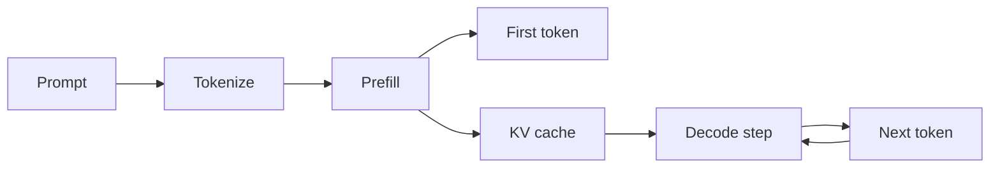

# Inference fundamentals

## What is inference?

Training adjusts model parameters from examples. Inference keeps those
parameters fixed and uses them to produce an output for a new input. For a
causal language model, inference repeatedly predicts the probability of the
next token and selects one according to the decoding settings.

## Tokens

A token is a unit used by a model's tokenizer. It may be a word, part of a word,
punctuation, or whitespace. Models see token identifiers, not raw text.

```text
"Inference is useful."
          |
          v
["Infer", "ence", " is", " useful", "."]
          |
          v
[4012, 873, 374, 5401, 13]       illustrative IDs only
```

Token counts matter because work and memory generally grow with the number of
input and output tokens.

## Prefill and decode

Inference has two performance regimes:

1. **Prefill** processes the input prompt. Many prompt tokens can be processed
   in parallel, so this phase is compute-intensive. Its visible result is the
   first output token.
2. **Decode** generates subsequent tokens. Each new token depends on previous
   tokens, so generation advances iteratively. Decode often moves a large
   amount of model and cache data for relatively little arithmetic.



This distinction explains why long prompts mainly affect **time to first token
(TTFT)**, while long answers mainly affect total latency and **inter-token
latency (ITL)**.

## Attention and the KV cache

Transformer attention computes a query, key, and value representation. During
autoregressive generation, keys and values for earlier tokens do not need to be
recomputed. The key-value cache stores them.

Without a cache, generating token 100 would repeatedly recompute states for
tokens 1 through 99. With a cache, the server reuses those states. The tradeoff
is memory: longer contexts, more concurrent requests, more layers, and larger
hidden dimensions increase KV-cache use.

## Latency and throughput

- **Latency** asks, “How long did one request take?”
- **Throughput** asks, “How much work finished per unit of time?”
- **Tail latency** focuses on slower requests such as p95 or p99.

A configuration can improve throughput while making one request slower because
the server waits briefly to form a larger batch. Neither number is sufficient
alone.

## Batching

Static batching groups requests that begin and end together. One long sequence
can make shorter sequences wait. Continuous batching changes the active batch
between decoding steps: completed sequences leave and waiting sequences enter.
This keeps the accelerator busier under irregular request lengths.

