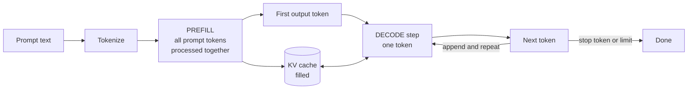

# Inference fundamentals

This guide covers the vocabulary the rest of the inference track assumes:
tokens, prefill and decode, the key-value cache, latency versus throughput, and
batching. Everything here applies to any language-model server, not just vLLM.

[How vLLM works](02-vllm-architecture.md) builds directly on these ideas, so
read this one first if terms like "prefill" or "KV cache" are new.

## What is inference?

Training adjusts a model's parameters using examples. Inference freezes those
parameters and uses them to produce an output for a new input.

```text
TRAINING                            INFERENCE
examples ---> model ---> loss       prompt ---> model ---> output
                 ^         |                      (parameters
                 |         |                       never change)
                 +---------+
              parameters change
```

For a language model, inference is not one calculation. It is a loop: predict
the next token, append it, predict again. A model does not "write an answer" —
it repeatedly answers the question "given everything so far, what comes next?"

## Tokens

A token is a chunk of text as the model's tokenizer sees it: a word, part of a
word, a punctuation mark, or a space. Models never see characters; they see
integer identifiers.

```text
"Inference is useful."
          |
          v  tokenizer
["Infer", "ence", " is", " useful", "."]
          |
          v
[4012, 873, 374, 5401, 13]        illustrative IDs only
```

Three things surprise people:

- **The leading space belongs to the token.** `" is"` and `"is"` are different
  tokens. This is why a stray trailing space in a prompt can change output.
- **Common words are one token; rare words are several.** `"Inference"` split
  into two pieces above, while `" useful"` stayed whole.
- **Tokens are not words.** A rough English rule of thumb is ~4 characters or
  ~0.75 words per token, but code, other languages, and unusual names can be
  far more expensive.

Token counts matter because nearly all cost, memory, and time scale with them.
When you set `--max-tokens 32` in the load tester, you are capping *output*
tokens; the prompt tokens are counted separately.

## Prefill and decode

Inference has two phases with completely different performance characteristics.
This distinction explains most of what follows in the other guides.



**Prefill** processes the whole prompt at once. Every prompt token can be
handled in parallel, because they are all already known. This is a big matrix
multiplication that keeps an accelerator genuinely busy — it is
*compute-bound*. Its visible output is the first token of the answer.

**Decode** produces one token at a time. Token 51 cannot be computed before
token 50 exists, so there is no way to parallelize within one sequence. Each
step reads the entire model's weights to produce a single token, doing very
little arithmetic with them — it is *memory-bound*.

That asymmetry is stark:

| | Prefill | Decode |
|---|---|---|
| Tokens handled per pass | All prompt tokens at once | One per sequence |
| Limited by | Compute | Memory bandwidth |
| Grows with | Prompt length | Answer length |
| Shows up as | Time to first token (TTFT) | Inter-token latency (ITL) |
| Made faster by | Chunking, prefix caching | Batching many sequences |

The practical consequence: **long prompts hurt TTFT; long answers hurt total
time.** If users complain the assistant is slow to start, look at prompt
length. If they complain it types slowly, look at decode and batching.

It also explains why batching is the central optimization. During decode, the
accelerator has already paid to read the weights — advancing sixty sequences
in that same pass costs barely more than advancing one.

## Attention and the KV cache

To produce a token, attention compares the current position against every
earlier position. It does so using three vectors per token: a **query**, a
**key**, and a **value**.

Keys and values for earlier tokens never change once computed. Without a cache,
generating token 100 would recompute keys and values for tokens 1 through 99 —
and generating token 101 would do it all again. The cost per token would grow
with position, and a long answer would crawl.

```text
NO CACHE                          WITH KV CACHE
token 1:   compute 1 token        token 1:   compute 1, store it
token 2:   recompute 1-2          token 2:   reuse 1, compute 2, store
token 3:   recompute 1-3          token 3:   reuse 1-2, compute 3, store
...                               ...
token 100: recompute 1-100        token 100: reuse 1-99, compute 100
           ~5,050 token-steps                ~100 token-steps
```

The key-value cache stores those vectors so each is computed once. That is what
makes decode roughly constant-cost per token instead of growing.

The price is memory, and it is substantial. Bytes per cached token:

```text
2 (key and value) x layers x kv_heads x head_dim x bytes_per_number
```

The cache grows with context length, with the number of concurrent requests,
and with model depth. On a busy server it, not the weights, is usually what
runs out first — which is why
[paged attention](02-vllm-architecture.md#paged-attention) exists.

## Latency and throughput

These two answer different questions and routinely move in opposite directions.

- **Latency:** how long did *one* request take? Measured per request.
- **Throughput:** how much work finished per second? Measured across the whole
  server.
- **Tail latency:** how bad was the unlucky user's experience? Reported as p95
  or p99.

A server can double throughput while making every individual request slower, by
waiting to gather bigger batches. Neither number alone tells you whether the
service is good:

```text
Configuration A          Configuration B
1 request at a time      64 requests at a time
latency  50 ms           latency  200 ms   (4x worse per request)
          20 req/s                320 req/s (16x better in total)
```

Which is better depends entirely on whether 200 ms is acceptable to your users.
That is why [measurement](05-measurement.md) insists on defining the workload
and the objective before quoting any number.

The load tester in this repository reports both, so you can watch the tradeoff
directly:

```bash
inference-lab-loadtest --requests 40 --concurrency 1 --stream
inference-lab-loadtest --requests 40 --concurrency 16 --stream
```

## Batching

Batching means processing several sequences in one pass over the model. Because
decode is memory-bound, this is close to free: the weights get read once
either way.

**Static batching** fixes the group at the start and holds it until every
member finishes. Uneven answer lengths waste slots:

```text
step:    1    2    3    4    5    6    7    8
R1 (2)  ##   ##    .    .    .    .    .    .
R2 (8)  ##   ##   ##   ##   ##   ##   ##   ##
R3 (3)  ##   ##   ##    .    .    .    .    .
              dots = finished, but still holding the slot
```

**Continuous batching** re-forms the group between steps, so finished sequences
leave immediately and queued ones join mid-flight. This is what vLLM does, and
[the vLLM guide](02-vllm-architecture.md#continuous-batching) works through the
timing in detail.

The gain depends entirely on how uneven your workload is. If every request has
an identical length, continuous and static batching perform about the same —
a useful thing to remember when reading benchmarks built on uniform prompts.

## Decoding: choosing the next token

The model does not output a token. It outputs a score for *every* token in its
vocabulary, which becomes a probability distribution. Something then has to
pick one:

```text
next-token probabilities        greedy       -> " useful"  (always)
  " useful"   0.62              temperature  -> samples; higher = flatter
  " helpful"  0.21                              distribution = more variety
  " fast"     0.09              top_p / top_k -> restrict to a shortlist
  ...                                            before sampling
```

**Greedy decoding** always takes the highest-probability token, so the same
prompt gives the same answer every time. That determinism is why
`training_labs/lora_inference.py` uses it — you cannot judge whether
fine-tuning changed a model if the output is different on every run.

Sampling settings affect quality and reproducibility, not really speed. Keep
them fixed while benchmarking, or you are measuring two things at once.

## Where these ideas appear in this repository

| Concept | See it in |
|---|---|
| Tokens, prompt versus output | `--max-tokens` in `inference_labs/loadtest.py` |
| Prefill versus decode | TTFT versus total latency in the load-test output |
| TTFT measurement | The first streamed chunk, `inference_labs/loadtest.py` |
| KV cache and paging | [docs/02](02-vllm-architecture.md#paged-attention) |
| Continuous batching | [docs/02](02-vllm-architecture.md#continuous-batching) |
| Latency versus throughput | `--concurrency` sweeps in [docs/05](05-measurement.md) |
| Batching payoff, no LLM needed | `labs/pytorch_inference.py`, [docs/04](04-pytorch-jax-vllm.md) |
| Greedy decoding | `training_labs/lora_inference.py` |

## See the difference yourself, without a GPU

`labs/pytorch_inference.py` demonstrates the batching payoff on a small neural
network, so it needs no model download and no accelerator:

```bash
uv sync --extra lora        # any install providing torch will do
uv run python labs/pytorch_inference.py --batch-sizes 1 4 16 64
```

```text
torch=2.13.0 device=cpu compiled=False
batch=  1 latency_ms=   0.291 items_per_second=    3432.0
batch=  4 latency_ms=   0.871 items_per_second=    4593.9
batch= 16 latency_ms=   0.943 items_per_second=   16960.1
batch= 64 latency_ms=   1.474 items_per_second=   43414.9
```

Going from batch 1 to batch 64 made each *pass* 5 times slower but did 12.6
times more work per second. That gap between "5x" and "12.6x" is the entire
economic argument for batching, and it is why an inference server tries so hard
to keep the batch full. Your numbers will differ; the shape should not.

Note `device=cpu` even on an Apple Silicon Mac. That lab deliberately checks
only for CUDA, because Apple's MPS backend has timing behavior that would muddy
the batch-size comparison it is making. The LoRA labs do use MPS. If PyTorch is
not installed, the lab exits with a pointer to
https://pytorch.org/get-started/locally/ rather than a traceback.

## Next

- [How vLLM works](02-vllm-architecture.md) — how a real server applies all of
  this.
- [Measurement](05-measurement.md) — how to measure it without fooling yourself.
- [Glossary](07-glossary.md) — every acronym used above, in one place.
