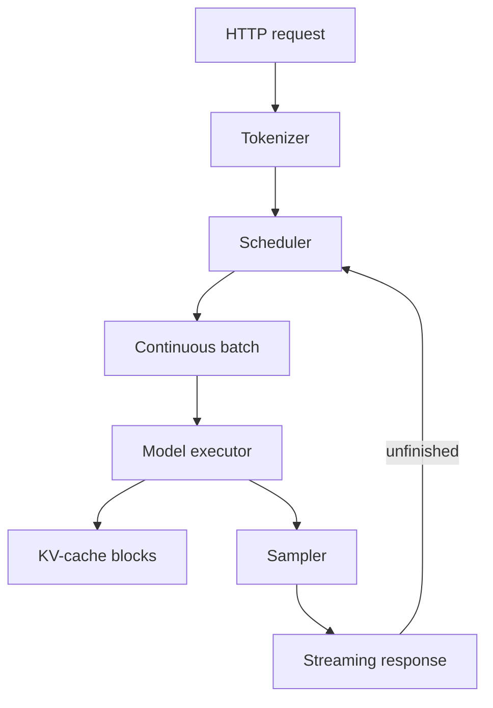

# How vLLM works

vLLM is a specialized inference-serving engine for supported language models.
It provides scheduling, memory management, streaming, and an
OpenAI-compatible HTTP interface.

## Request path



## Paged attention

The KV cache does not grow identically for every request. Allocating one large,
contiguous region per request can waste memory and cause fragmentation. vLLM
manages KV-cache memory in blocks, conceptually similar to virtual-memory
pages. A request receives blocks as it grows, and blocks return to a free pool
when no longer needed.

The word “paged” describes the block-management idea. It does not mean that GPU
memory behaves exactly like an operating system's disk-backed virtual memory.

## Continuous batching

At each scheduling step, vLLM considers waiting, running, and completed
requests. Newly available capacity can be used without waiting for every
sequence in the previous batch to finish. This is particularly helpful when
prompt and response lengths vary.

## OpenAI-compatible API

The API shape allows one client to target different backends:

```text
client ---> POST /v1/chat/completions ---> vLLM-Metal on a Mac
       \--> POST /v1/chat/completions ---> vLLM on NVIDIA CUDA
```

Compatibility describes the HTTP contract. It does not mean the server calls
OpenAI or uses an OpenAI-hosted model.

## Apple Metal and NVIDIA CUDA

The common layers are the vLLM command, scheduler concepts, HTTP API, and
measurement client. The execution backend differs:

- vLLM-Metal uses Apple's Metal graphics and compute interface with MLX.
- NVIDIA deployments use CUDA and CUDA-oriented kernels and libraries.

Results from different hardware should not be treated as an apples-to-apples
performance comparison unless the model, numerical format, software versions,
prompt distribution, output distribution, and measurement method are controlled.

