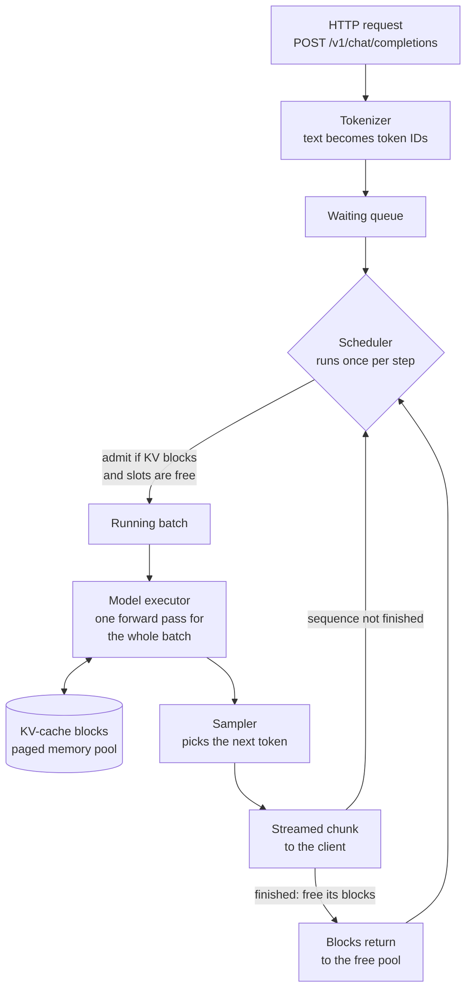

# How vLLM works

vLLM is a server that holds a trained language model in accelerator memory and
answers requests over the network. Training is finished by the time vLLM is
involved; its only job is to run the finished model for many callers at once,
quickly, without running out of memory.

This guide explains what it does internally, how those internals turn into
speed, which files in this repository start it, and how to run it yourself.
[Inference fundamentals](01-inference-basics.md) covers the vocabulary used
here (tokens, prefill, decode, key-value cache). Read that one first if
"prefill" and "KV cache" are new terms.

## The problem vLLM solves

A single request to a language model is easy to serve. Write fifty lines of
PyTorch, load the weights, call the model in a loop. The difficulty appears
when many people send requests at the same time, with prompts and answers of
wildly different lengths.

Think of a restaurant kitchen with one very fast chef. Three separate things go
wrong, and vLLM has a distinct mechanism for each:

| Problem | The naive kitchen | What vLLM does instead |
|---|---|---|
| **1. The chef idles** | Cook one order start to finish, then take the next | **Batching:** put many sequences into a single pass over the model, so one trip through the weights serves everybody |
| **2. Quick orders wait for slow ones** | Take four orders, cook them together, serve all four when the slowest is done | **Continuous batching:** rebuild the group after *every* step, so a finished order leaves at once and a waiting one takes its place |
| **3. The counter fills with reserved-but-empty space** | Reserve a full counter's width per order, in case that order turns out to be large | **Paged attention:** hand out small fixed-size blocks only as an order actually grows, and take them back when it leaves |

Spelled out in the model's own terms:

1. **Idling** happens because generating one token is mostly memory movement —
   the accelerator reads the entire model to produce a single token, and does
   very little arithmetic with it. Reading those same weights once to advance
   sixty sequences instead of one costs barely more than reading them for one.
   Batching is what makes a GPU worth using here.

2. **Waiting for the slowest** happens because answer lengths are unknown and
   uneven. If the batch is fixed when it starts, a two-token reply is stuck
   holding a slot until a two-hundred-token reply finishes. vLLM's scheduler
   therefore runs once per *step* rather than once per batch, and reconsiders
   membership each time. See [continuous batching](#continuous-batching).

3. **Reserved-but-empty space** happens because the key-value cache has to be
   sized before the answer exists. Reserving the maximum for every request is
   the safe choice and wastes most of the memory, which caps how many requests
   fit at once. vLLM splits that memory into small blocks and allocates them on
   demand, so a request pays only for the tokens it really produced. See
   [paged attention](#paged-attention).

Problems 1 and 2 are about **keeping the accelerator busy**; problem 3 is about
**fitting more requests into memory**. They compound: solving 3 leaves room for
more concurrent sequences, which gives 1 and 2 more to batch.

## Where vLLM lives in this repository

Worth knowing up front: **no Python file in this project imports vLLM.**
`inference_labs/serve.py` builds a `vllm serve ...` command line and starts it
as a separate process, exactly as if you had typed it. Everything else talks to
it over plain HTTP.

| File | What it does with vLLM |
|---|---|
| `inference_labs/serve.py` | **The only file that starts vLLM.** Detects the hardware, assembles the `vllm serve` command, prints it, and runs it as a subprocess |
| `configs/serve.toml` | Every tuning flag vLLM receives. Layered `[common]` → `[backend.*]` → `[profile.*]` |
| `inference_labs/hardware.py` | Chooses `metal` or `cuda`, which selects the `[backend.*]` section |
| `inference_labs/doctor.py` | Checks whether a `vllm` executable is on `PATH` before you spend minutes on a failed start |
| `deploy/nvidia/vllm.yaml` | Kubernetes example running the official `vllm/vllm-openai` container image |
| `inference_labs/loadtest.py` | A **client**. Sends HTTP requests to vLLM and measures them. Needs no vLLM install |
| `inference_labs/mock_server.py` | **Not vLLM.** A fake endpoint with `time.sleep` delays, so the tests can exercise streaming without downloading a model. Never quote its timings |

The split matters: the measuring client and the server are independent
programs. You can run the server on a remote GPU machine and the load tester on
your laptop, and neither needs the other installed.

## Running inference with vLLM

### Step 1 — see the command before running anything

`--dry-run` prints the command and stops. It works on any machine, even
without vLLM installed, which makes it the cheapest way to understand what the
wrapper is doing:

```bash
inference-lab-serve --backend metal --profile learning --dry-run
```

```text
backend=metal: explicit override selected metal
vllm serve Qwen/Qwen3-0.6B --host 127.0.0.1 --port 8000 --generation-config vllm --max-model-len 4096 --max-num-seqs 16 --enable-prefix-caching
```

The first line goes to standard error, the command to standard output, so you
can pipe the command somewhere without capturing the diagnostic note. Nothing
is hidden: that second line is a command you could type by hand.

### Step 2 — check the machine is ready

```bash
inference-lab-doctor
```

This reports the detected backend and whether a `vllm` executable is on your
`PATH`. If it is not, follow [installation](00-installation.md) — Apple Silicon
uses the upstream vLLM-Metal installer, NVIDIA uses `uv pip install vllm`.

### Step 3 — start the server

Drop `--dry-run` and the same command runs in the foreground:

```bash
inference-lab-serve --profile learning
```

The first start is slow: it downloads `Qwen/Qwen3-0.6B` (a deliberately small
model) and loads it into memory. Wait for the line saying the server is
listening on `http://127.0.0.1:8000`. `Control-C` stops it.

Leave that terminal running and open a second one for the next steps.

### Step 4 — send one request by hand

vLLM speaks the OpenAI HTTP protocol, so ordinary `curl` works:

```bash
curl http://127.0.0.1:8000/v1/chat/completions \
  -H "Content-Type: application/json" \
  -d '{
    "model": "Qwen/Qwen3-0.6B",
    "messages": [{"role": "user", "content": "Explain a KV cache in one sentence."}],
    "max_tokens": 64
  }'
```

Add `"stream": true` and the answer arrives as a series of server-sent events —
one chunk per token or small group of tokens — instead of a single block at the
end. That difference is what makes time to first token measurable.

Two other endpoints are useful while learning:

```bash
curl http://127.0.0.1:8000/health     # readiness, used by deploy/nvidia/vllm.yaml
curl http://127.0.0.1:8000/metrics    # Prometheus counters: cache hits, queue depth, preemptions
```

### Step 5 — measure it under load

```bash
inference-lab-loadtest --requests 40 --concurrency 8 --stream
```

`--stream` is required for time-to-first-token numbers, because that value is
measured from the arrival of the first streamed chunk. See
[measurement](05-measurement.md) for how to read the percentiles, and
[tuning](03-tuning.md) for changing settings and comparing runs.

No accelerator handy? This runs the same measurement loop against the mock
server, starting and stopping it for you:

```bash
python -m inference_labs.demo --requests 40 --concurrency 8
```

It teaches the workflow, not the performance. The mock server's latencies are
`time.sleep` constants.

## What happens inside one request



The loop at the bottom is the important part. The scheduler does not run once
per request; it runs once per **step**, and every step it re-decides who is in
the batch. A request that finishes at step 40 releases its memory at step 40,
and a request waiting in the queue can start at step 41.

## Paged attention

### The waste it removes

During generation the model stores a key and a value vector for every token it
has seen, so it does not recompute them for each new output token. That storage
is the KV cache, and it dominates memory use on a busy server.

The trouble is that you do not know how long an answer will be when it starts.
The simple approach is to reserve the worst case — enough contiguous memory for
`max_model_len` tokens — for every request. Almost all of it goes unused.

Some arithmetic makes the scale clear. Bytes of KV cache per token:

```text
2 (key and value) x layers x kv_heads x head_dim x bytes_per_number
```

For an illustrative model with 24 layers, 8 key-value heads, a head dimension
of 128, and 16-bit numbers:

```text
2 x 24 x 8 x 128 x 2 bytes = 98,304 bytes = 96 KiB per token
```

Now compare the two strategies for a request whose answer turns out to be 300
tokens long, on a server configured with `max_model_len = 4096`:

```text
RESERVE THE WORST CASE (contiguous)
+----------------------------------------------------------+
|##### used: 300 tokens |         unused: 3,796 tokens      |
+----------------------------------------------------------+
 4,096 tokens x 96 KiB  = 384 MiB reserved
 300 tokens x 96 KiB    =  28 MiB actually used
                          356 MiB wasted, and unusable by anyone else

PAGED BLOCKS (16 tokens per block)
+------+------+------+     +------+------+
| blk1 | blk2 | blk3 | ... | blk18| blk19|   19 blocks x 1.5 MiB = 28.5 MiB
+------+------+------+     +------+---##-+
 304 token slots for 300 tokens = 4 slots wasted = 384 KiB
```

Illustrative arithmetic, not a measurement — but the ratio is the point. The
wasted memory falls from **356 MiB to 384 KiB**, and waste is bounded by one
partly-filled block per request no matter how long the answer runs.

That memory does not just sit there looking tidy; it becomes concurrency. Given
8 GiB of KV-cache space, the reserve-the-worst-case scheme fits about 21 of
these requests. Paged blocks fit roughly 287.

### How the blocks work

Blocks are fixed-size (commonly 16 tokens) and need not be next to each other
in physical memory. Each sequence keeps a block table — a list of which
physical blocks hold its tokens, in order — and the attention kernel follows
that table instead of assuming one contiguous run:

```text
sequence A logical view:  [tok 1..16][tok 17..32][tok 33..40]
                              |          |           |
block table for A:            v          v           v
                          physical    physical    physical
                          block 7     block 2     block 9

physical memory pool:  [ 1 ][ 2 ][ 3 ][ 4 ][ 5 ][ 6 ][ 7 ][ 8 ][ 9 ]
                            A                        A         A
```

This is the same trick an operating system uses to give a process a tidy
address space out of scattered physical pages, which is where the name comes
from. The analogy stops there: there is no disk-backed swapping in the usual
sense, and "paged" describes the block bookkeeping, not virtual memory.

Two things fall out of the design almost for free:

- **Sharing.** Two sequences with identical starting tokens can point their
  block tables at the *same* physical blocks. No copying. This is the mechanism
  behind prefix caching, and behind serving several samples of one prompt
  cheaply.
- **Growth on demand.** A sequence gets one more block when it fills the last
  one, so a short answer never pays for a long one.

## Continuous batching

Accelerators are efficient when they process many sequences in one pass. The
question is how the batch is assembled.

**Static batching** fixes the group when it starts and holds it until every
member is done. Suppose four requests want 2, 8, 3, and 2 tokens of output:

```text
step:      1    2    3    4    5    6    7    8    9   10
R1 (2)    ##   ##    .    .    .    .    .    .
R2 (8)    ##   ##   ##   ##   ##   ##   ##   ##
R3 (3)    ##   ##   ##    .    .    .    .    .
R4 (2)    ##   ##    .    .    .    .    .    .
R5             ....... waiting in the queue .......   ##   ##
                    ^
                    dots are wasted batch slots: the work is
                    finished but the memory is still held
```

**Continuous batching** re-forms the batch every step. Finished sequences leave
at once, their blocks return to the pool, and waiting requests take their place
mid-flight:

```text
step:      1    2    3    4    5    6    7    8
R1 (2)    ##   ##
R2 (8)    ##   ##   ##   ##   ##   ##   ##   ##
R3 (3)    ##   ##   ##
R4 (2)    ##   ##
R5 (2)              ##   ##        <- admitted the step after R1 left
R6 (3)              ##   ##   ##
R7 (2)                        ##   ##
R8 (3)                        ##   ##   ##
```

Same eight steps, more than twice the requests completed. The gain comes
entirely from not making finished work wait for unfinished work, and it grows
with how uneven the output lengths are. When every request is identical in
length, continuous batching and static batching perform much the same — which
is a useful warning about benchmarks built on uniform prompts.

`max_num_seqs` in `configs/serve.toml` is the cap on how many sequences may sit
in one step's batch. The `learning` and `latency` profiles set 16; `throughput`
sets 128.

## Prefill, decode, and chunked prefill

Prefill (processing the prompt) and decode (producing one token at a time) have
opposite appetites. Prefill is a big parallel matrix computation; decode moves
a lot of memory for little arithmetic. Mixing them in one batch is what keeps
the accelerator busy — but a very long prompt can hog the step and stall
everyone else's token generation.

```text
without chunked prefill
step 1: [ 8,000-token prefill for R9 .............. ] decode for R1..R8 delayed
                                                      users see generation freeze

with chunked prefill (budget 2,048 tokens per step)
step 1: [ prefill chunk 1/4 ] [ decode R1..R8 ]
step 2: [ prefill chunk 2/4 ] [ decode R1..R8 ]
step 3: [ prefill chunk 3/4 ] [ decode R1..R8 ]
step 4: [ prefill chunk 4/4 ] [ decode R1..R8 ]  R9's first token appears
```

R9 waits slightly longer for its first token; everyone else keeps generating
smoothly. The token budget is `max_num_batched_tokens`, which is exactly why
the `latency` profile sets 2048 and the `throughput` profile sets 16384. See
[tuning](03-tuning.md) for running that comparison yourself.

## How the pieces add up to performance

| Mechanism | What it removes | Visible effect | The cost |
|---|---|---|---|
| KV cache | Recomputing earlier tokens every step | Decode stays roughly constant per token | Memory grows with context and concurrency |
| Paged blocks | Reserved-but-unused KV memory | Many more concurrent requests per GPU | Block bookkeeping; needs a paging-aware kernel |
| Continuous batching | Idle slots held by finished sequences | Higher throughput under uneven lengths | Little, when lengths are uneven |
| Prefix caching | Re-prefilling a shared prompt prefix | Lower TTFT for repeated documents | No gain when prompts share nothing |
| Chunked prefill | Long prefills blocking decode | Smoother inter-token latency | Slightly later first token for the long prompt |
| Quantization | Bits per weight or per cache entry | Less memory, sometimes more speed | Possible quality loss; kernel support varies |

None of these makes a single isolated request dramatically faster. They make a
*loaded server* far more efficient, which is why measuring with one request at a
time tells you almost nothing about how vLLM will behave in practice. Raise
`--concurrency` in the load tester and the differences appear.

Two mechanisms in the table are already on in every profile in this repository
(`enable_prefix_caching = true`, and chunked prefill, which modern vLLM enables
by default where it can). Paged attention and continuous batching are not
flags at all — they are simply how the engine works.

## The OpenAI-compatible API

vLLM implements the same HTTP request and response shapes as OpenAI's API. One
client can therefore target any of them without vendor-specific code:

```text
                        POST /v1/chat/completions
inference-lab-loadtest -----+---> vLLM-Metal on a Mac laptop
                            +---> vLLM on an NVIDIA GPU server
                            +---> the mock server in this repo (tests only)
```

Compatibility is about the wire format only. The server does not call OpenAI
and does not use an OpenAI-hosted model; it runs the weights you pointed it at.
This is why `loadtest.py` contains no vLLM-specific code, and why the same tool
can measure a completely different backend.

Authentication is off by default because the default bind address is
`127.0.0.1`, reachable only from your own machine. If you bind elsewhere, set
`VLLM_API_KEY` — `serve.py` reads it from the environment and appends
`--api-key`, so the secret never lands in your shell history.

## Apple Metal and NVIDIA CUDA

The layers that stay the same across both are the `vllm serve` command shape,
the scheduler concepts above, the HTTP API, and the measurement client. What
changes is the execution backend underneath:

- **vLLM-Metal** uses Apple's Metal compute interface with MLX on Apple Silicon.
- **NVIDIA** deployments use CUDA and its kernel libraries.

The configuration reflects that with one flag's difference. Compare the two
real command lines:

```bash
inference-lab-serve --backend metal --profile latency --dry-run
inference-lab-serve --backend cuda  --profile latency --dry-run
```

```text
vllm serve Qwen/Qwen3-0.6B --host 127.0.0.1 --port 8000 --generation-config vllm --max-model-len 4096 --max-num-seqs 16 --max-num-batched-tokens 2048 --enable-prefix-caching
vllm serve Qwen/Qwen3-0.6B --host 127.0.0.1 --port 8000 --generation-config vllm --gpu-memory-utilization 0.9 --max-model-len 4096 --max-num-seqs 16 --max-num-batched-tokens 2048 --enable-prefix-caching
```

The only difference is `--gpu-memory-utilization 0.9`, which comes from
`[backend.cuda]` in `configs/serve.toml`. Apple Silicon has unified memory
shared with the rest of the system, so that dial does not apply there. Not
every CUDA feature or model is available through vLLM-Metal yet.

Results from different hardware are not an apples-to-apples comparison unless
the model, numerical format, software versions, prompt distribution, output
distribution, and measurement method are all held fixed.

## Next

- [Optimization and tuning](03-tuning.md) — change one setting and compare runs.
- [Measurement and observability](05-measurement.md) — percentiles, and why a
  single fast run proves nothing.
- [Troubleshooting](06-troubleshooting.md) — when the server refuses to start.
- vLLM server options:
  https://docs.vllm.ai/en/latest/serving/openai_compatible_server.html
