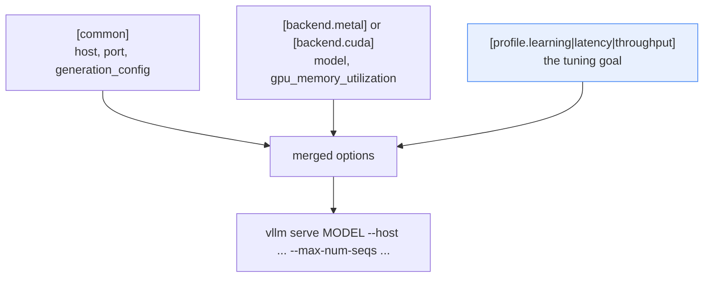

# Optimization and tuning

Tuning is an experiment, not a list of universally fast flags. Any setting that
helps one workload can hurt another, and most "this made it 3x faster" claims
are really "this suited my prompt lengths."

The method is always the same: start with `learning`, record a baseline, change
**one** setting, run the **same** workload, and compare.

[How vLLM works](02-vllm-architecture.md) explains the mechanisms. This guide
is about turning them into measurements.

## The rule that makes everything else work

```text
BAD                                GOOD
change 3 settings                  change 1 setting
run once                           run 3+ times
new number is better               compare medians
-> "it is faster"                  -> "p95 TTFT fell 12%, p99 ITL rose 4%,
                                       at concurrency 8 with 128/64 tokens"
```

Without a fixed workload, a latency number means nothing. Always state the
model, the concurrency, the input and output token counts, and the arrival
pattern alongside any result.

## Where the settings live

None of the tuning knobs are in the Python. They are in `configs/serve.toml`,
which is layered in three levels, each overriding the one before:



Later layers win. That is what makes a fair comparison possible: swapping the
profile changes the tuning goal without disturbing anything about the hardware.

Each key becomes a flag by replacing underscores with hyphens, so
`max_num_seqs = 64` emits `--max-num-seqs 64`. A `true` value emits a bare flag
with no value; `false` emits nothing at all.

## See it for yourself

`--dry-run` prints the command without running anything, so this works on any
machine, even with no vLLM installed:

```bash
inference-lab-serve --backend metal --profile latency --dry-run
inference-lab-serve --backend metal --profile throughput --dry-run
```

```text
vllm serve Qwen/Qwen3-0.6B --host 127.0.0.1 --port 8000 --generation-config vllm --max-model-len 4096 --max-num-seqs 16 --max-num-batched-tokens 2048 --enable-prefix-caching
vllm serve Qwen/Qwen3-0.6B --host 127.0.0.1 --port 8000 --generation-config vllm --max-model-len 4096 --max-num-seqs 128 --max-num-batched-tokens 16384 --enable-prefix-caching
```

Exactly two values differ — `--max-num-seqs` (16 vs 128) and
`--max-num-batched-tokens` (2048 vs 16384). Everything else is held constant,
which is what makes the A/B comparison meaningful.

## The tuning map

| Mechanism | What it changes | Often helps | Main risks |
|---|---|---|---|
| Batching (`max_num_seqs`) | How many sequences per step | Throughput, utilization | Queueing, tail latency, KV memory |
| Token budget (`max_num_batched_tokens`) | Work admitted per step | TTFT or ITL, depending on direction | The opposite one gets worse |
| Prefix caching | Reuse of shared prompt prefixes | Repeated long contexts | Nothing gained if prompts differ |
| Context length (`max_model_len`) | Capacity reserved per request | Memory, concurrency | Rejects longer requests |
| GPU memory fraction | Share of VRAM vLLM may use | KV-cache capacity | Out-of-memory if set too high |
| Quantization | Bits per weight or cache entry | Memory, sometimes speed | Quality loss, kernel support |
| Tensor parallelism | Splits a model across GPUs | Models too big for one GPU | Communication overhead |

## Maximum sequences

`max_num_seqs` caps how many sequences may take part in a single step. Raising
it gives the scheduler more batching opportunity — but each admitted sequence
needs KV-cache memory, and a fuller batch makes every step slightly longer.

```text
max_num_seqs = 16                    max_num_seqs = 128
+--------------------------+         +--------------------------+
| 16 sequences per step    |         | up to 128 per step       |
| step is short            |         | step is longer           |
| 17th request waits       |         | more finish per second   |
| lower ITL per user       |         | higher ITL per user      |
+--------------------------+         +--------------------------+
```

The profiles use 16 for `learning` and `latency`, 128 for `throughput`, so the
difference is visible. These are starting points, not recommendations — the
right value depends on your model size and available memory.

## The token budget and chunked prefill

`max_num_batched_tokens` is the number of tokens the scheduler may admit per
step, and it is where the latency/throughput tradeoff is sharpest.

A long prompt has to be prefilled. Without a budget, that prefill monopolizes
the step and everyone else's generation visibly stalls:

```text
budget 16384 (throughput)            budget 2048 (latency)
step 1: [ 8k prefill for R9 ....]    step 1: [2k chunk][decode R1-R8]
        decode for R1-R8 stalls      step 2: [2k chunk][decode R1-R8]
        users see a freeze           step 3: [2k chunk][decode R1-R8]
                                     step 4: [2k chunk][decode R1-R8]
R9 first token: sooner               R9 first token: slightly later
Everyone else: stuttered             Everyone else: smooth
```

So the two directions are a genuine tradeoff, not better versus worse:

- **Smaller budget (2048)** improves inter-token latency, because a big prefill
  cannot delay decode work as badly.
- **Larger budget (16384)** improves prefill efficiency, TTFT for long prompts,
  and aggregate throughput, at the cost of tail ITL and more memory.

Modern vLLM (V1) enables chunked prefill by default where it can. The budget is
how you steer it.

## Prefix caching

The ordinary KV cache helps within a single request. **Automatic prefix caching
(APC)** goes further and reuses cached blocks *across* requests that begin with
the same tokens:

```text
request A: [ same 2,000-token document ][ question A ]
request B: [ same 2,000-token document ][ question B ]
             ^^^^^^^^^^^^^^^^^^^^^^^^^^
             prefilled once, reused by B for free
```

It is enabled in all three profiles:

```toml
enable_prefix_caching = true
```

Two limits worth understanding:

- It reduces repeated **prefill** work only. It does nothing for the cost of
  generating a long new answer.
- The match must be an exact token prefix from the very start. A timestamp or a
  user name at the top of your system prompt destroys the shared prefix, and
  the hit rate collapses to zero.

To test it, send the same long system prompt with different questions and watch
TTFT and the cache-hit counters at `/metrics`. Unrelated prompts show no gain,
which is the correct result rather than a failure.

## Context length

`max_model_len` caps the sequence length the server will accept. Every
concurrent request may need cache up to this length, so it directly limits how
many fit at once:

```text
8 GiB of KV cache, ~96 KiB per token:
  max_model_len 4096  ->  reserve budget for ~21 full-length requests
  max_model_len 2048  ->  roughly twice as many, but 4k requests are rejected
```

Do not advertise a context length the server cannot sustain at your expected
concurrency. Rejecting a long request is honest; accepting it and then
thrashing is not.

For a one-off experiment you can override without editing the file, though the
config is better for anything you intend to repeat:

```bash
inference-lab-serve --model Qwen/Qwen3-0.6B \
  --extra-arg=--max-model-len \
  --extra-arg=8192
```

`--extra-arg` is appended verbatim after everything else, so it can override
any flag built from the config.

## CUDA memory utilization

`[backend.cuda]` sets:

```toml
gpu_memory_utilization = 0.90
```

This is the fraction of GPU memory vLLM may claim for its executor. Whatever is
left after weights and overhead becomes KV cache — so this dial mostly controls
concurrency:

```text
24 GiB GPU, 1.2 GiB of weights
  0.90 -> ~21.6 GiB for vLLM -> large KV cache, more concurrency
  0.95 -> more cache, but little headroom for the driver and transient buffers
  0.80 -> safer, smaller cache, fewer concurrent requests
```

Too high and you get out-of-memory errors or preemption; too low and you have
paid for memory that sits idle. Watch the preemption counter in `/metrics`
rather than guessing. Apple Silicon has no equivalent setting because memory is
unified with the system.

## Quantization

Quantization stores weights, activations, or cache entries with fewer bits. A
4-bit weight uses a quarter the space of a 16-bit one — though real savings are
smaller, because metadata, temporary buffers, and unquantized components remain.

The safest beginner approach is to pick a checkpoint someone already prepared
for your backend, rather than converting weights yourself on the first attempt:

```bash
# Example Metal model from the vLLM-Metal supported-model matrix
inference-lab-serve --backend metal \
  --model mlx-community/Qwen2.5-7B-Instruct-4bit
```

On NVIDIA, choose a vLLM-supported quantized checkpoint and check that its
format is efficient on your actual GPU generation. A smaller model at higher
precision often beats a larger, poorly supported quantized one.

Measure output *quality* as well as speed. Quantization changes generated text,
and aggressive formats may be unusable for your task. A faster wrong answer is
not an optimization.

## Adding your own profile

Because profiles live in the TOML, adding one is a data change. Append a
section:

```toml
[profile.batch]
max_num_seqs = 64
max_num_batched_tokens = 8192
enable_prefix_caching = true
```

Then use it immediately, with no code edit:

```bash
inference-lab-serve --profile batch --dry-run
```

Name one that does not exist and the command stops with the profiles it
actually found, read from your file rather than a list hardcoded in Python:

```text
unknown profile 'typo'; choose from latency, learning, throughput. See docs/03-tuning.md.
```

## A complete worked experiment

This is the shortest experiment that produces a defensible conclusion. Two
terminals: server in one, client in the other.

**1. Baseline.** Start with the `latency` profile:

```bash
inference-lab-serve --profile latency
```

**2. Warm up, then measure.** The first request includes initialization, so
throw it away:

```bash
mkdir -p results        # --json-output will not create the directory for you
inference-lab-loadtest --requests 5  --concurrency 1 --stream   # discard
inference-lab-loadtest --requests 60 --concurrency 8 --stream \
  --json-output results/latency-c8-run1.json
```

**3. Repeat.** Run it three times. One run tells you nothing about variance.

**4. Change exactly one thing.** Stop the server, restart with the other
profile, and repeat the identical client commands:

```bash
inference-lab-serve --profile throughput
inference-lab-loadtest --requests 60 --concurrency 8 --stream \
  --json-output results/throughput-c8-run1.json
```

**5. Compare medians, not best runs**, and record it in `RESULTS.md`:

| Profile | Concurrency | TTFT p95 | E2E p95 | Requests/s | Errors |
|---|---:|---:|---:|---:|---:|
| latency | 8 | | | | |
| throughput | 8 | | | | |
| latency | 32 | | | | |
| throughput | 32 | | | | |

Expect the difference to be small at concurrency 1 and to widen as concurrency
rises. If both profiles look identical, your concurrency is too low for
batching to matter — that is a real and useful finding.

## How to read the result

| Observation | Likely meaning |
|---|---|
| Throughput up, p95 TTFT up | Working as intended; decide if the tradeoff suits you |
| Throughput flat, latency up | Past the useful point; go back |
| Errors appear | Memory or queue limits exceeded; reduce and retest |
| p50 improved, p99 much worse | An average would have hidden this. Trust p99 |
| No difference at any concurrency | The setting is not your bottleneck |

Stop tuning when throughput flattens, errors appear, or p99 becomes
unacceptable — whichever comes first.

## Things that are not tuning

- **A faster single request.** Most of these mechanisms only pay off under
  concurrency. Benchmarking with one request at a time measures almost nothing
  about them.
- **Uniform prompts.** Continuous batching's advantage comes from *uneven*
  lengths. Identical requests make it look worthless.
- **Comparing across hardware.** Metal versus CUDA numbers are not comparable
  unless model, precision, versions, prompts, and method are all fixed.
- **Quoting the mock server.** Its latencies are `time.sleep` constants.

## Next

- [Measurement](05-measurement.md) — percentiles, warm-up, and what to record.
- [Troubleshooting](06-troubleshooting.md) — when a setting causes a crash.
