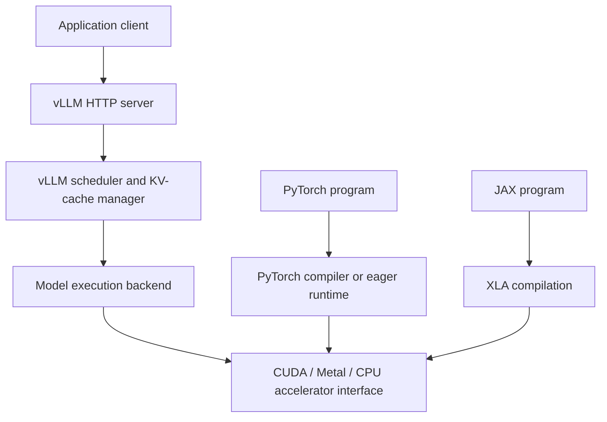

# PyTorch, JAX, and vLLM

## The simplest distinction

- **PyTorch** is a general tensor and machine-learning framework with a large
  model ecosystem. It is commonly used for both training and inference.
- **JAX** provides composable numerical-program transformations such as
  just-in-time compilation, automatic vectorization, and automatic
  differentiation. XLA compiles the resulting computation for CPUs and
  accelerators.
- **vLLM** is a specialized serving engine for supported language models. It
  focuses on request scheduling, KV-cache memory, continuous batching,
  streaming, and serving APIs.

## Layering

The boxes are conceptual; exact backend implementation differs by platform and
version.

## When to use each

| Need | PyTorch | JAX | vLLM |
|---|---:|---:|---:|
| Define a new neural network | Strong | Strong | No |
| Train or fine-tune | Strong | Strong | No |
| Numerical research | Strong | Strong | Limited |
| Serve supported LLMs over HTTP | Build more pieces | Build more pieces | Primary purpose |
| Continuous batching | Implement/integrate | Implement/integrate | Included |
| Paged KV-cache management | Implement/integrate | Implement/integrate | Included |
| OpenAI-compatible API | Implement/integrate | Implement/integrate | Included |

## PyTorch exercise

`labs/pytorch_inference.py` builds a small multilayer perceptron and compares
batch sizes. It uses `torch.inference_mode()` to disable gradient bookkeeping
and optionally `torch.compile()` to compile suitable computation regions.

This lab teaches framework execution and measurement. It is not an LLM server
and does not reproduce vLLM's scheduler or KV-cache management.

## JAX exercise

`labs/jax_inference.py` uses:

- `jax.vmap` to vectorize a function over a batch dimension;
- `jax.jit` to compile it;
- `block_until_ready()` so asynchronous accelerator work completes before the
  timer stops.

Without synchronization, a benchmark may measure only dispatch time and report
an unrealistically small duration.

## Why vLLM-Metal mentions MLX rather than JAX or normal PyTorch

The Metal plugin uses MLX as its primary Apple Silicon compute backend. The
vLLM API and scheduling concepts remain, but the low-level execution path is
not the same as NVIDIA CUDA vLLM. This is why a Mac run is real inference yet
not a substitute for measuring CUDA-specific behavior.

