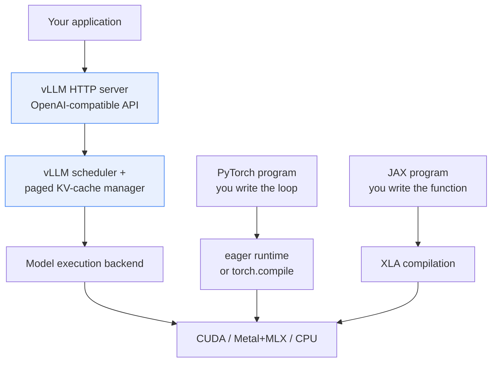

# PyTorch, JAX, and vLLM

Beginners often assume these are three competing choices for the same job. They
are not. Two are general frameworks for *building and running* numerical models;
the third is a finished *server* for one specific task.

```text
"I want to invent a new model architecture."      -> PyTorch or JAX
"I want to fine-tune a model on my data."         -> PyTorch or JAX
"I want to serve an existing LLM to 500 users."   -> vLLM
"I want to serve my brand-new architecture."      -> PyTorch/JAX to build it,
                                                     then add vLLM support
```

## The one-line version

- **PyTorch** — a general tensor and machine-learning framework with a huge
  model ecosystem. Executes operations as it meets them, which makes it easy to
  debug. Used for both training and inference.
- **JAX** — composable transformations of numerical programs: compile it
  (`jit`), vectorize it (`vmap`), differentiate it (`grad`). XLA compiles the
  result for CPUs, GPUs, and TPUs.
- **vLLM** — a serving engine for supported language models. It does not help
  you define a model; it handles request scheduling, KV-cache memory,
  continuous batching, streaming, and an HTTP API.

## How they stack up



The important structural point: **vLLM sits above the framework layer, not
beside it.** It owns the parts a framework leaves to you — deciding which
requests run this step, where their cache lives, and when to evict it.

## What you would have to build yourself

If you serve an LLM with plain PyTorch, you get the model forward pass and
nothing else. Everything below is what vLLM already did:

| Need | PyTorch | JAX | vLLM |
|---|---|---|---|
| Define a new neural network | Strong | Strong | Not its job |
| Train or fine-tune | Strong | Strong | Not its job |
| Numerical research | Strong | Strong | Limited |
| Run one prompt | Easy | Easy | Easy |
| Serve over HTTP | Build it | Build it | Included |
| Continuous batching | Build it | Build it | Included |
| Paged KV-cache management | Build it | Build it | Included |
| Streaming responses | Build it | Build it | Included |
| Prefix caching | Build it | Build it | Included |
| OpenAI-compatible API | Build it | Build it | Included |

"Build it" is not a small note. Continuous batching and paged attention are the
hard parts, and doing them badly is worse than not doing them at all.

## PyTorch versus JAX in practice

| | PyTorch | JAX |
|---|---|---|
| Execution | Runs each operation immediately | Traces, then compiles the function |
| Weights | The model object holds them | Values you pass in explicitly |
| Batching | Written into your tensor shapes | `vmap` adds the dimension for you |
| Compilation | `torch.compile`, opt-in | `jit`, the normal way to work |
| Mutable state | Allowed | Arrays immutable, functions pure |
| First call | Normal speed | Slow — it is compiling |
| Debugging | Straightforward | Harder inside compiled code |

Neither is better. JAX's constraints — immutability and purity — are precisely
what make its aggressive compilation safe. PyTorch's looseness is what makes it
forgiving when something goes wrong.

## The PyTorch exercise

`labs/pytorch_inference.py` builds a small multilayer perceptron and times it at
several batch sizes. No model download, no accelerator needed:

```bash
uv sync --extra lora        # any install providing torch will do
uv run python labs/pytorch_inference.py --batch-sizes 1 4 16 64 --iterations 30
```

```text
torch=2.13.0 device=cpu compiled=False
batch=  1 latency_ms=   0.291 items_per_second=    3432.0
batch=  4 latency_ms=   0.871 items_per_second=    4593.9
batch= 16 latency_ms=   0.943 items_per_second=   16960.1
batch= 64 latency_ms=   1.474 items_per_second=   43414.9
```

Read the two columns against each other:

```text
batch     latency      throughput
  1   ->   0.291 ms      3,432 items/s   baseline
 64   ->   1.474 ms     43,415 items/s
         5.1x slower    12.6x more work
```

**Each pass got 5x slower while the machine did 12.6x more work per second.**
That gap is the whole argument for batching, and it is why an inference server
works so hard to keep its batch full. Notice also that batch 4 → 16 barely
changed latency (0.871 → 0.943 ms) while throughput nearly quadrupled: the
hardware was underused at batch 4.

Your absolute numbers will differ. The shape should not.

Two details in that lab worth reading the code for:

- `torch.inference_mode()` disables gradient bookkeeping. Forgetting it is a
  classic way to make inference needlessly slow and memory-hungry.
- `device=cpu` appears even on an Apple Silicon Mac. That is deliberate — the
  lab checks only for CUDA, because Apple's MPS backend has timing behavior
  that would muddy this specific comparison. The LoRA labs do use MPS.

Add `--compile` to see what `torch.compile()` does to the same numbers. Expect
a slow first iteration while it compiles.

## The JAX exercise

`labs/jax_inference.py` runs the same experiment, printing the same table
format so you can compare directly. JAX is not a dependency of this project;
install it from https://docs.jax.dev/en/latest/installation.html and the lab
will exit with that pointer if it is missing.

```bash
uv run python labs/jax_inference.py --batch-sizes 1 4 16 64
```

It demonstrates three things:

- **`jax.vmap`** — write the function for a single item, and `vmap` produces a
  batched version. You never hand-write the batch dimension.
- **`jax.jit`** — compile on the first call with a given input shape, then
  reuse that compiled code. A new shape triggers a fresh compile.
- **`block_until_ready()`** — JAX dispatches work asynchronously. Without this,
  your timer stops when the work was *queued*, not when it *finished*, and you
  will report an impossibly fast result.

That last point is the most valuable lesson in the lab, and it applies
everywhere:

```text
WRONG                               RIGHT
t0 = time()                         t0 = time()
result = f(x)     <- queued only    result = f(x)
t1 = time()                         result.block_until_ready()
                                    t1 = time()
"0.01 ms!"  <- measured dispatch    a real duration
```

PyTorch has the same hazard on CUDA, which is why the PyTorch lab calls
`torch.cuda.synchronize()` before stopping its timer. Any benchmark on an
accelerator that does not synchronize is probably wrong.

## Why vLLM-Metal involves MLX

On Apple Silicon, the vLLM Metal plugin uses **MLX** as its compute backend —
not PyTorch's MPS path, and not JAX. The vLLM API, scheduler, and HTTP contract
are unchanged, but the low-level execution path differs from CUDA vLLM.

```text
NVIDIA:        vLLM -> CUDA kernels          -> NVIDIA GPU
Apple Silicon: vLLM -> vLLM-Metal -> MLX     -> Apple GPU
                       ^^^^^^^^^^^^^^^^^^ different execution, same API
```

So a Mac run is real inference and teaches the API, batching, caching,
streaming, and measurement workflow properly. It is *not* a substitute for
measuring CUDA-specific behavior, and not every CUDA feature or model is
available through the Metal path.

## Which one should you learn first?

```text
Goal: understand how models work      -> PyTorch (docs/12, the LoRA lab)
Goal: run and measure LLM serving     -> vLLM    (docs/02, docs/05)
Goal: compilers and large-scale HPC   -> JAX
```

This repository uses PyTorch for the LoRA fine-tuning labs, vLLM for the
serving labs, and JAX only in the one comparison lab above.

## Where each appears in this repository

| File | Framework | Purpose |
|---|---|---|
| `labs/pytorch_inference.py` | PyTorch | Batching and compilation timing |
| `labs/jax_inference.py` | JAX | The same result, compiled-first style |
| `training_labs/lora_finetune.py` | PyTorch + PEFT | Real fine-tuning |
| `training_labs/lora_inference.py` | PyTorch + PEFT | Base model plus adapter |
| `inference_labs/serve.py` | none | Builds and runs a `vllm serve` command |
| `inference_labs/loadtest.py` | none | Pure `urllib` and `asyncio` HTTP client |

Note the last two. The serving track uses no framework at all — vLLM runs as a
separate process and everything else talks to it over HTTP.

## Next

- [How vLLM works](02-vllm-architecture.md) — what the serving layer adds.
- [Measurement](05-measurement.md) — timing things without fooling yourself.
- [LoRA fine-tuning](12-lora-finetuning.md) — PyTorch used in anger.
