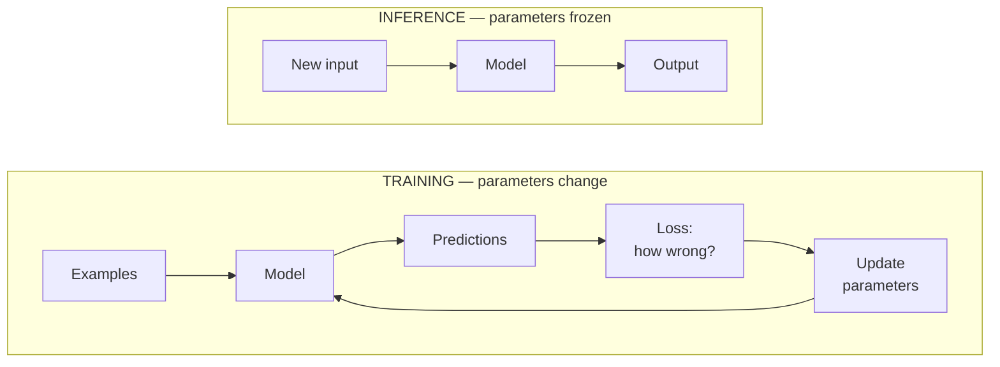

# Machine-learning training overview

This is the entry point for the training track. It explains what training is,
how the four labs differ, and the vocabulary they share. None of it needs a GPU.

## Training versus inference

**Training** changes a model's parameters. **Inference** freezes them and uses
the model to produce output. The difference is one loop:



During training that loop runs thousands of times. At inference the loss and
the update simply disappear: input goes in, output comes out, nothing changes.

Every lab in this track ends by doing inference with what it just learned —
predicting a price, assigning a cluster, walking a grid, generating text. That
is how you tell whether the training accomplished anything.

## The four strategies

They are not four ways to solve the same problem. Which one applies is decided
by **what feedback your data actually contains**:

```text
Do you have correct answers for each example?
├── Yes ──────────────────────────> SUPERVISED      (linear regression)
└── No
    ├── Do you get rewards for acting? ─ Yes ─────> REINFORCEMENT  (Q-learning)
    ├── Do you have a pretrained model
    │   and some examples? ────────── Yes ────────> TRANSFER       (LoRA)
    └── Just unlabeled data? ─────────────────────> UNSUPERVISED   (K-means)
```

| Strategy | Learns from | Lab | Command | Produces |
|---|---|---|---|---|
| Supervised | Inputs paired with correct answers | Linear regression | `ml-lab-linear` | A price prediction |
| Unsupervised | Inputs with no answers | K-means | `ml-lab-kmeans` | Customer groups |
| Reinforcement | Actions and delayed rewards | Q-learning | `ml-lab-q-learning` | A navigation policy |
| Transfer | A pretrained model plus examples | LoRA | `ml-lab-lora` | A model adapter |

## Run all four in five minutes

The first three need only `uv sync` — no downloads, no accelerator, no
third-party packages at all:

```bash
uv sync
uv run ml-lab-linear
uv run ml-lab-kmeans --clusters 3
uv run ml-lab-q-learning --episodes 2000
```

```text
rows: 20 (train=16, test=4)
training MSE: 16205.03 -> 83.66
test RMSE: 21.33 thousand dollars
sample prediction for 1,800 sq ft, 3 bedrooms, age 12: $612k

points: 18, clusters: 3
cluster 0: center=(1673.33, 6.3), members=6
cluster 1: center=(3433.33, 11.42), members=6
cluster 2: center=(610.0, 1.83), members=6
inertia (lower is tighter): 1088275.19
silhouette score (-1 to 1; higher is better): 0.768

→ → → → ↓
↓ ■ ■ → ↓
→ → → → ↓
↑ ■ ↓ ■ ↓
↑ → → → G
greedy path (8 steps): [(0, 0), (0, 1), ... (4, 4)]
```

Three completely different kinds of learning, all in plain Python you can read
line by line. The fourth needs PyTorch:

```bash
uv sync --extra lora
uv run ml-lab-lora --dry-run     # confirms setup before any download
```

## Reading the three outputs

Each lab reports the thing that matters for its kind of learning:

**Linear regression** — error fell from 16205 to 84 during training, and on
four *held-out* rows the error is 21.33 thousand dollars. The held-out number
is the honest one; the training number only says the optimizer worked.

**K-means** — no correct answer exists, so it reports two quality measures.
Inertia says how tight the clusters are; silhouette says how well separated.
Neither is an accuracy score, because there is nothing to be accurate about.

**Q-learning** — no dataset at all. The arrows *are* the learned policy: in
each square, the direction the agent now believes is best. Eight steps is the
shortest possible route on this grid.

## Common vocabulary

- A **feature** is an input value, such as square footage.
- A **label** or **target** is the desired output, such as a sale price.
  Unsupervised learning has none — that is its defining property.
- A **parameter** is learned by the algorithm: a regression weight, a Q-value.
- A **hyperparameter** is chosen by you: learning rate, number of clusters,
  discount factor. Tuning means searching these.
- A **loss function** turns errors into a single number to minimize.
- An **epoch** is one pass through the dataset.
- A **batch** is a group of examples processed before one update.
- **Generalization** is performing well on new examples rather than memorizing
  the training ones.

## The idea underneath all of them

Despite different mechanics, three of the four labs do the same thing: start
with a guess, measure how wrong it is, adjust, repeat.

```text
                 guess -> measure -> adjust -> repeat

linear regression: weights -> MSE          -> step downhill
K-means:           centers -> distances    -> move to the mean
Q-learning:        Q-table -> reward seen  -> blend toward the new estimate
LoRA:              adapter -> token loss   -> step downhill
```

The differences are in what "measure how wrong" means when nobody told you the
right answer. Recognizing that shared skeleton makes each new algorithm much
easier to learn.

## Why no NumPy?

The first three labs implement gradient descent, Lloyd's algorithm, and
Q-learning against Python's standard library alone. That is deliberate: you can
read every line without also learning an array library, and nothing important
is hidden inside a vectorized call.

The cost is speed. These implementations would be far too slow for real
datasets, where NumPy or PyTorch is not optional. Understanding first, speed
second.

## A practical experiment loop

1. Define the prediction or behavior you want.
2. Decide how success will be measured — **before** running anything.
3. Record a simple baseline. Always predicting the mean is a legitimate one.
4. Split supervised data into training, validation, and test subsets.
5. Change one hyperparameter at a time.
6. Compare using the same split and the same random seed.
7. Save configuration, metrics, hardware, versions, and artifacts.

Step 3 matters more than beginners expect. If predicting the average price
scores nearly as well as your model, your model has learned nothing useful.

## What these small labs leave out

Real systems also need data validation, experiment tracking, privacy controls,
monitoring, reproducibility guarantees, and a plan for model and data drift.
The labs here favor clarity over scale, and 20-row datasets let a model
effectively memorize — which is a teaching feature, not an oversight.

## Where to go next

```text
ml-lab-linear     -> docs/09  supervised learning, gradient descent
ml-lab-kmeans     -> docs/10  unsupervised learning, choosing K
ml-lab-q-learning -> docs/11  reinforcement learning, Q-tables
ml-lab-lora       -> docs/12  transfer learning on a real language model
                     docs/13  the datasets all of them read
```

The LoRA lab is the bridge to the inference track: it produces an adapter,
which [docs/12](12-lora-finetuning.md) then loads for generation — real
inference on a real language model, at which point
[docs/01](01-inference-basics.md) picks up the story.
