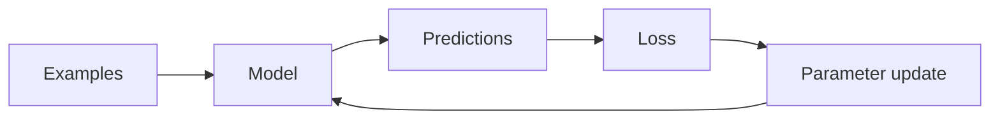

# Machine-learning training overview

## Training versus inference

**Training** changes model parameters. **Inference** holds those parameters
fixed and uses them to make predictions or generate text.

During training, this loop repeats. During inference, the loss and parameter
update disappear: input goes into the fixed model and output comes back.

## Four learning strategies in this repository

| Strategy | Learns from | Lab | Example result |
|---|---|---|---|
| Supervised learning | Inputs paired with correct targets | Linear regression | Predicted house price |
| Unsupervised learning | Inputs without target labels | K-means | Customer cluster |
| Reinforcement learning | Actions and delayed rewards | Q-learning | Navigation policy |
| Transfer learning | A pretrained model plus new examples | LoRA | Language-model adapter |

These are not four competing ways to solve every problem. The correct strategy
depends on what feedback exists and what output is required.

## Common vocabulary

- A **feature** is an input value, such as square footage.
- A **label** or **target** is the desired output, such as a sale price.
- A **parameter** is a value learned by the algorithm, such as a regression
  weight.
- A **hyperparameter** is chosen by the practitioner, such as learning rate,
  number of clusters, or discount factor.
- A **loss function** turns prediction errors into a number to minimize.
- An **epoch** is one pass through a dataset.
- A **batch** is a group of examples processed before an update.
- **Generalization** means performing well on new examples, not only memorizing
  training examples.

## A practical experiment loop

1. Define the prediction or behavior you want.
2. Decide how success will be measured.
3. Record a simple baseline.
4. Split supervised data into training, validation, and test subsets.
5. Change one hyperparameter at a time.
6. Compare results using the same split and random seed.
7. Save configuration, metrics, hardware, software versions, and artifacts.

Small examples in this repository favor clarity over scale. Production systems
also need data validation, experiment tracking, privacy controls, monitoring,
repeatability, and a plan for model and data drift.

