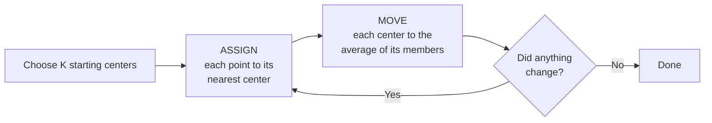

# K-means clustering

Unsupervised learning: there is no column containing the right answer. The
algorithm gets points and must propose the groups itself.

```bash
uv sync
uv run ml-lab-kmeans --clusters 3
```

```text
points: 18, clusters: 3
cluster 0: center=(1673.33, 6.3), members=6
cluster 1: center=(3433.33, 11.42), members=6
cluster 2: center=(610.0, 1.83), members=6
inertia (lower is tighter): 1088275.19
silhouette score (-1 to 1; higher is better): 0.768
```

Eighteen customers, described by annual spending and monthly visits, sorted
into three even groups: low spenders who rarely visit, mid-range regulars, and
high spenders who visit often.

## What "no labels" changes

```text
SUPERVISED (docs/09)              UNSUPERVISED (here)
square_feet,...,price             annual_spend,visits_per_month
850,...,315                       420,1.0
920,...,330                       510,1.5
        ^^^                              ^^^
        the answer                       ...there is no answer column
```

There is no accuracy to compute, because there is nothing to be accurate
against. This changes the whole activity: instead of "how close were we?", the
question becomes "is this grouping any good?" — which needs different tools
and, ultimately, judgment.

## The algorithm

K-means alternates two dead-simple steps until nothing moves:



Watched over a few rounds:

```text
round 1: centers placed          round 2: centers moved       final
  x  .  .    .  .  o               .  .  .    .  x  o           groups stable
  .  x .   o  .  .                 x  .  .  o  .  .             centers at the
  .  .  . x  .  .  o               .  x  .  .  .  o             middle of each
       ^ points snap to             ^ centers slide to
         nearest center               their members' mean
```

Each step can only reduce the total distance, so it always terminates. It does
**not** guarantee the best possible grouping — only one that cannot be improved
by these two moves.

## The two quality numbers

Because there is no answer key, the lab reports two different measures. They
disagree, and that disagreement is the whole lesson.

Sweep K and watch:

```bash
uv run ml-lab-kmeans --clusters 2
uv run ml-lab-kmeans --clusters 3
uv run ml-lab-kmeans --clusters 4
uv run ml-lab-kmeans --clusters 5
```

Real results:

| K | Inertia | Silhouette | Members per cluster |
|---:|---:|---:|---|
| 2 | 4,480,368 | 0.714 | 12, 6 |
| 3 | **1,088,275** | **0.768** | 6, 6, 6 |
| 4 | 951,741 | 0.661 | 4, 6, 6, 2 |
| 5 | 392,731 | 0.587 | 4, 2, 6, 2, 4 |

Read the two columns against each other:

```text
inertia                          silhouette
  |*                               |
  | *                              |      *  <- peak at K=3
  |                                |  *      *
  |    *                           |            *
  |         *                      |
  +----------------> K             +----------------> K
   2   3   4   5                    2   3   4   5

  always falls                     peaks, then falls
  cannot choose K                  CAN choose K
```

**Inertia** is the total squared distance from points to their assigned
centers. It falls every time you add a cluster — and at K = 18 it would reach
zero, with every customer in a cluster of one. A number that always improves
as you add complexity cannot tell you how much complexity to use.

**Silhouette** compares how close each point is to its own cluster versus the
nearest *other* cluster, from −1 to 1. It rewards tight groups that are also
well separated, so it can be beaten by both too few and too many clusters. Here
it peaks cleanly at K = 3.

Notice K = 4 and K = 5 produce clusters of 2 members. Inertia loves that;
silhouette correctly reports it as splitting a real group into arbitrary
fragments.

| | Inertia | Silhouette |
|---|---|---|
| Range | 0 to ∞, scale-dependent | −1 to 1 |
| Direction | Lower is tighter | Higher is better separated |
| With more K | Always falls | Rises then falls |
| Can choose K? | **No** | **Yes**, among sensible K |
| Watches | Distance within a cluster | Within *versus* between |

## Interpretability is the third criterion

A statistically tighter grouping is not automatically more useful. If your
marketing team can act on three segments but not seven, three is the better
answer even when the silhouette score prefers seven. Neither number knows what
you plan to do with the result.

## Initialization matters

The two steps only ever improve on where they started, so a poor start can
strand the algorithm in a poor result:

```text
BAD START                          GOOD SPREAD (k-means++)
  o o                              o        .        o
  x x    .        .                x        x        x
  ^ two centers land in the        ^ centers begin far apart, so each
    same blob; one real group        real group attracts its own
    ends up split, another                    
    never gets a center
```

The lab uses a k-means++-style initializer: after the first center is chosen at
random, points **farther** from existing centers are more likely to be picked
next. That spreads the starting positions and makes a bad outcome much less
likely.

`--seed` makes runs reproducible, which matters because the initialization is
random:

```bash
uv run ml-lab-kmeans --clusters 3 --seed 1
uv run ml-lab-kmeans --clusters 3 --seed 42
```

On this data at K = 3 both seeds give an identical result — inertia 1088275.19,
silhouette 0.768 — because the three groups are genuinely well separated and
k-means++ reliably finds them.

That stability is the point of the exercise. If different seeds *do* give
noticeably different groupings, the instability is itself a finding: it usually
means K is wrong or the clusters are not really distinct. Try `--clusters 5`
across several seeds and compare.

## Scaling matters

K-means measures distance, so a feature with a large numeric range dominates
the calculation:

```text
annual_spend:      420 to 3,980     <- range ~3,560
visits_per_month:  1.0 to 13.0      <- range ~12

A 100-unit difference in spending outweighs the ENTIRE range of visits.
```

The bundled data was constructed so the groups stay visible despite this, but
in general you must standardize first — subtract each feature's mean, divide by
its spread — or you are effectively clustering on spending alone.

Standardizing and comparing the assignments is the single most valuable
extension to this lab.

## Code to study

Open `training_labs/kmeans.py`:

| What | Where |
|---|---|
| `load_points` | Reads the CSV by column name (`:56`) |
| `squared_distance` | Skips the square root — order is preserved, arithmetic saved |
| k-means++ initialization | Distance-weighted choice of starting centers |
| The assign step | Each point to its nearest center |
| The move step | Each center to its members' mean |
| Inertia | Total squared distance |
| Silhouette | Within-cluster versus nearest-other-cluster distance |

`squared_distance` is a nice piece of practical thinking: comparing distances
never needs the square root, because squaring preserves ordering. It runs in
the innermost loop, so skipping it matters.

## About the data

`data/customer_segments.csv` holds 18 synthetic customers with two columns and
no labels:

```bash
head -5 data/customer_segments.csv
```

Like `load_csv` in the regression lab, `load_points` reads columns **by name**
(`annual_spend`, `visits_per_month`) and assumes exactly two dimensions. See
[datasets](13-datasets.md#moving-to-real-data) before pointing `--data`
elsewhere.

## Experiments worth running

1. **Push K to the extreme.** Try `--clusters 18` — one cluster per customer:

   ```text
   inertia (lower is tighter): 0.00
   silhouette score (-1 to 1; higher is better): 1.000
   ```

   Inertia hits exactly 0, which is the clearest possible proof that it cannot
   choose K. But look at the silhouette score: this implementation reports a
   perfect 1.000 for the degenerate case too. A singleton cluster has no
   within-cluster distance to compute, and the usual convention is to score it
   0 rather than 1.

   So "silhouette can choose K" holds among *sensible* values of K, not
   against a cluster-per-point degenerate. No single number replaces looking at
   the cluster sizes — which is why the lab prints them.
2. **Standardize the columns** and see whether the assignments change.
3. **Sweep seeds** at K = 3 and K = 5. Which is more stable?
4. **Run Iris** ([datasets](13-datasets.md#iris--clustering)) where the true
   answer is known, and check that silhouette recovers K = 3.

## Useful extensions

- Run several random initializations and keep the lowest inertia.
- Plot the points and centers — two dimensions makes this easy and revealing.
- Try k-medoids, which is less sensitive to outliers.
- Add categorical features only after choosing a suitable encoding and distance
  metric; Euclidean distance on one-hot columns is rarely what you want.

## Next

- [Reinforcement learning](11-reinforcement-learning.md) — learning with no
  dataset at all.
- [Training overview](08-training-overview.md) — how the four strategies relate.
