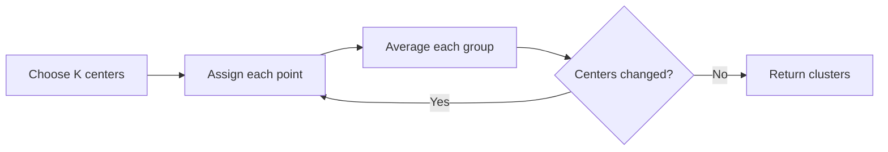

# K-means clustering

K-means is unsupervised learning. There is no column containing the correct
cluster. The algorithm receives points and tries to find `K` compact groups.



The sample clusters customers using annual spending and monthly visits:

```bash
uv run ml-lab-kmeans --clusters 3
```

Try `--clusters 2`, `3`, `4`, and `5`. Compare:

- **Inertia:** total squared distance from points to their assigned centers.
  It always tends to decrease as K increases, so it cannot select K alone.
- **Silhouette score:** compares how close each point is to its own cluster
  versus other clusters. Values nearer 1 indicate clearer separation.
- **Interpretability:** a statistically tighter grouping is not automatically
  more useful for a real decision.

## Initialization matters

Poor initial centers can produce a poor final result. The lab uses a small
K-means++-style initializer: after the first random center, points farther from
existing centers are more likely to be selected. The `--seed` option makes the
experiment reproducible.

## Scaling matters

K-means uses distance. If annual spending ranges from 0 to 10,000 while visits
range from 0 to 20, spending can dominate the calculation. The tiny bundled
data was constructed so the groups are still visible, but a serious extension
should standardize both features.

## Useful extensions

- Standardize the columns and compare assignments.
- Run several random initializations and retain the lowest inertia.
- Plot the points and centers.
- Add categorical features only after choosing a suitable encoding and metric.
- Try the classic Iris dataset described in [datasets](13-datasets.md).

