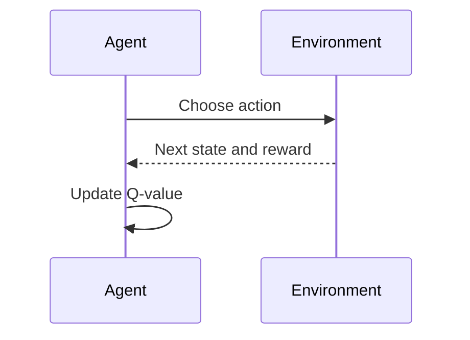

# Reinforcement learning and Q-learning

Reinforcement learning (RL) trains an **agent** by interacting with an
**environment**. The agent sees a state, chooses an action, receives a reward,
and moves to another state.



Unlike linear regression, there is no fixed CSV containing the correct action
for every state. The agent produces its own experience while exploring.

## The GridWorld lab

The goal is worth `+10`. Each nonterminal step costs `-0.1`. Obstacles and
boundaries prevent movement. The step cost encourages a short route.

```bash
uv run ml-lab-q-learning --episodes 2000
```

The output displays a learned arrow for each open cell, obstacles as `■`, and
the goal as `G`.

## Q-values

`Q(state, action)` estimates the discounted future reward from taking an
action in a state. The update is:

```text
new Q = old Q + learning_rate * (
    reward + discount * best_future_Q - old Q
)
```

- **Learning rate** controls how strongly new experience changes the table.
- **Discount factor** controls how much future rewards matter.
- **Epsilon** is the probability of exploring rather than taking the current
  best-known action.

The lab decays epsilon over time: explore more early, exploit more later.

## This is real RL, but intentionally small

The Q-table works because the state and action spaces are tiny. Modern deep
reinforcement learning replaces the table with neural networks and may use
experience replay, target networks, policy gradients, actor-critic methods,
distributed rollouts, and safety constraints. Those additions improve scale
but can obscure the core feedback loop this lab demonstrates.

Try fewer episodes, different seeds, a larger step penalty, or a smaller
discount. Record whether the greedy policy reaches the goal and how many steps
it uses.

