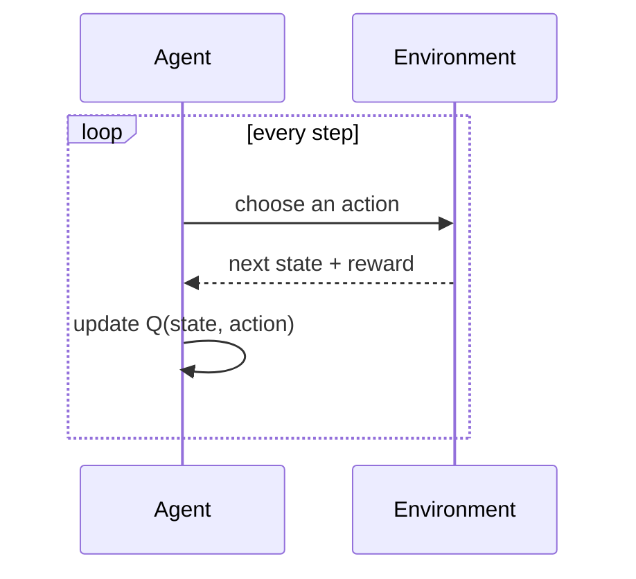

# Reinforcement learning and Q-learning

The third kind of learning, and the strangest: **there is no dataset**. The
agent generates its own training data by acting in a world and seeing what
happens.

```bash
uv sync
uv run ml-lab-q-learning --episodes 2000
```

```text
→ → → → ↓
↓ ■ ■ → ↓
→ → → → ↓
↑ ■ ↓ ■ ↓
↑ → → → G
greedy path (8 steps): [(0, 0), (0, 1), (0, 2), (0, 3), (0, 4), (1, 4), (2, 4), (3, 4), (4, 4)]
```

Every arrow is a decision the agent worked out for itself. Nobody ever told it
the right move for any square.

## How this differs from the other labs

```text
SUPERVISED (docs/09)        UNSUPERVISED (docs/10)     REINFORCEMENT (here)
a file of inputs            a file of inputs           NO FILE
  with correct answers        with no answers          the agent acts and
                                                       receives rewards
"predict this number"       "find groups"              "behave well"
feedback: immediate         feedback: none             feedback: delayed
          and exact
```

The word to focus on is **delayed**. The agent gets +10 for reaching the goal,
but the move that mattered most may have been eight steps earlier. Working out
which earlier actions deserve credit for a later reward is the central problem
reinforcement learning solves.



## The GridWorld

A 5×5 grid. The agent starts top-left, the goal is bottom-right, and `#` marks
walls it cannot enter:

```text
        col 0   1   2   3   4
    row 0  S   .   .   .   .        S = start (0, 0)
    row 1  .   #   #   .   .        G = goal  (4, 4)
    row 2  .   .   .   .   .        # = obstacle
    row 3  .   #   .   #   .
    row 4  .   .   .   .   G
```

The rewards are the whole specification of what "good" means:

| Event | Reward |
|---|---|
| Reaching the goal | **+10**, and the episode ends |
| Any other move | **−0.1** |

That small per-step penalty is what makes the agent prefer short routes.
Dawdling is not forbidden, merely expensive, so the shortest path keeps the
most reward. Change that number and you change the agent's entire personality —
which is the most important thing this lab teaches.

## The Q-table

"Q" is for quality. The agent keeps one row per square and one column per
action, each cell estimating "if I take this action here and play sensibly
afterwards, how much total reward do I end up with?"

```text
                  up     right   down    left
    (0, 0)      -0.35    4.21    4.98   -0.35
    (0, 1)      -0.30    4.87    2.10    3.90
    ...
```

Once that table is filled in, behaving well is trivial: in each square, take
the action with the highest number. **The table *is* the policy.** The arrows
printed by the lab are just that table's per-row winner drawn as a picture.

## The update rule

One line does all the learning:

```text
new Q = old Q + learning_rate * ( reward + discount * best_future_Q - old Q )
                                  \_______________________________/   \____/
                                     what we now think it is worth    what we
                                     (reward we got, plus the best     thought
                                      we can do from where we landed)
                                  \___________________________________________/
                                        the surprise: how wrong we were
```

The agent nudges its old estimate toward a better-informed one. The size of
that nudge is the learning rate.

The lab's defaults:

| Setting | Value | Meaning |
|---|---|---|
| `learning_rate` | 0.2 | How strongly new experience overwrites the old estimate |
| `discount` | 0.95 | How much a future reward is worth versus an immediate one |
| `epsilon` | 0.8 → 0.02 | Probability of exploring instead of exploiting |

**Discount** is worth dwelling on. At 0.95, a reward ten steps away is still
worth 0.95¹⁰ ≈ 0.60 of its face value — enough to be visible from across the
grid. Set it low and the agent becomes short-sighted, unable to see the goal
from far away, and the policy falls apart.

## Explore versus exploit

An agent that always takes its current best action never discovers anything
better. One that always acts randomly never uses what it knows.

```text
epsilon = 0.8 (early)              epsilon = 0.02 (late)
mostly random wandering            mostly following the table
"what is out here?"                "I know the way, take it"

        the lab decays epsilon linearly between the two:
        explore first, exploit later
```

The decay is `max(0.02, 0.8 * (1 - episode/episodes))` — so the floor of 0.02
keeps a little exploration alive to the very end.

## How much experience is enough?

Real results from varying `--episodes`:

| Episodes | Result |
|---:|---|
| 1, 3, 5, 10, 20, 25 | `RuntimeError: the learned policy did not reach the goal` |
| 30 | Succeeds — 8 steps |
| 50 | Succeeds — 8 steps |
| 2000 | Succeeds — 8 steps |

The transition is sharp: somewhere between 25 and 30 episodes, the reward
information has propagated back far enough from the goal for a complete path to
exist. Below that, the agent has simply never carried the news of the +10 all
the way to the starting square.

```bash
uv run ml-lab-q-learning --episodes 25    # fails, loudly
uv run ml-lab-q-learning --episodes 30    # works
```

Note the failure is a `RuntimeError`, not a silently bad policy. The lab checks
whether the greedy policy actually reaches the goal, which is a much better
test than "did the loss go down".

Also note that **every success takes 8 steps**. On this grid, 8 is the
shortest possible route (4 down + 4 right, with the walls not forcing a
detour). So extra episodes do not find a shorter path — they change *which*
optimal path is chosen, and make the arrows in squares far from the goal more
sensible. Compare the routes at 30 and 2000 episodes: same length, different
scenery.

## How reward spreads backward

This is the mechanism behind that threshold. Initially every cell is 0. Only
squares next to the goal can learn anything, because only they see the +10.

```text
episode ~1              episode ~5              episode ~30
. . . . .               . . . . .               → → → → ↓
. # # . .               . # # . .               ↓ # # → ↓
. . . . .               . . . . .               → → → → ↓
. # . # .               . # . # ↓               ↑ # ↓ # ↓
. . . . G               . . . → G               ↑ → → → G
nothing known           the news of +10         a complete path
                        has spread one          exists from the start
                        square outward
```

Each episode lets the information travel roughly one more square back from the
goal. That is why a grid this small needs a few dozen episodes, and why bigger
worlds need dramatically more.

## Code to study

Open `training_labs/q_learning.py`:

| What | Where |
|---|---|
| `ACTIONS` / `MOVES` | The four actions and their coordinate deltas (`:59`) |
| Epsilon decay | `max(0.02, epsilon * (1 - episode/episodes))` (`:183`) |
| Action choice | Random if under epsilon, else the table's best (`:188`) |
| The update rule | The one line where learning happens (`:226`) |
| Greedy evaluation | Walks the final policy and verifies it reaches the goal |

The action index is also the column index into the Q-table, so `"right"` is
always column 1 — a small design decision that keeps the table code simple.

## Experiments worth running

The CLI exposes only two flags:

```bash
uv run ml-lab-q-learning --help
#   --episodes EPISODES
#   --seed SEED
```

So the first two experiments are command-line work, and the rest mean editing
the defaults in `train()` — which is a feature, since it makes you read the
code that uses them.

**From the command line:**

1. **Find the threshold yourself.** Binary-search between 25 and 30 episodes.
2. **Vary the seed** at a low episode count. Near the threshold luck matters;
   at 2000 episodes it does not.

```bash
uv run ml-lab-q-learning --episodes 30 --seed 1
uv run ml-lab-q-learning --episodes 30 --seed 42
```

**By editing `training_labs/q_learning.py`:**

3. **Change the step penalty** from −0.1. At −2.0 the agent becomes desperate
   to finish; at 0 it has no reason to prefer a short path at all.
4. **Lower `discount`** from 0.95 to 0.5 and watch the policy degrade — at
   0.5¹⁰ ≈ 0.001, the goal is effectively invisible from the far corner.
5. **Set `epsilon` to 0** to disable exploration, and see how much worse a
   purely greedy agent does.

## This is real RL, deliberately kept small

The Q-table works here only because the world is tiny — 25 squares × 4 actions
is 100 numbers. A chess-sized state space cannot be tabulated, and a camera
image never repeats exactly.

Modern deep reinforcement learning replaces the table with a neural network
that *generalizes* across similar states, and adds experience replay, target
networks, policy gradients, actor-critic methods, distributed rollouts, and
safety constraints. Every one of those improves scale while obscuring the
feedback loop you can see plainly here.

The loop itself — act, observe reward, update an estimate, repeat — is
identical.

## Next

- [LoRA fine-tuning](12-lora-finetuning.md) — transfer learning on a real
  language model.
- [Training overview](08-training-overview.md) — how the four strategies relate.
- Sutton & Barto, *Reinforcement Learning: An Introduction*, chapter 6:
  http://incompleteideas.net/book/the-book-2nd.html
