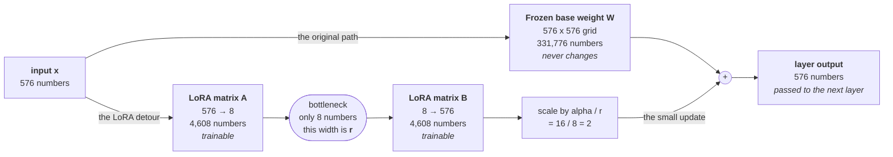
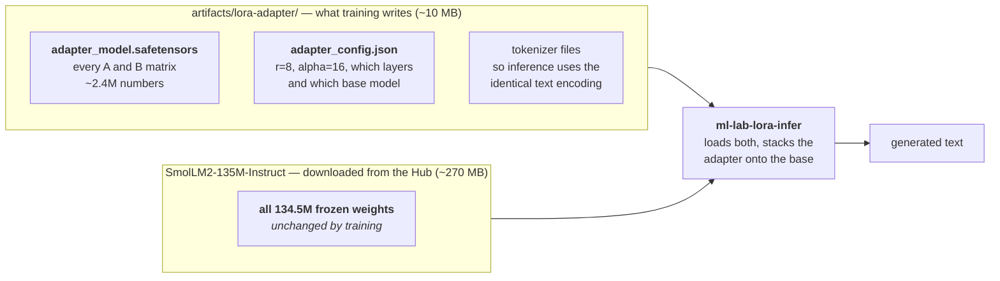

# Fine-tuning a language model with LoRA

## The problem LoRA solves

You have a pretrained language model. It already speaks English well, because
somebody spent a lot of money training it on a very large pile of text. But it
does not answer the way you want — maybe you need a particular tone, a
particular format, or knowledge of your own domain.

The obvious fix is **full fine-tuning**: keep training the model, but on your
examples instead of the original pile. This works, and it is expensive in three
separate ways:

1. **Every number in the model needs a gradient.** A gradient is one extra
   number per parameter, saying which way that parameter should move.
2. **The optimizer needs its own state.** AdamW, the standard choice, keeps two
   running averages per parameter. That is two more numbers each.
3. **You get a whole second model on disk.** Fine-tuning a 7-billion-parameter
   model produces another 7-billion-parameter model. Fine-tune it for five
   different tasks and you are storing five complete copies.

So the memory bill during training is roughly *four times* the size of the
model — the weights themselves, plus a gradient, plus two optimizer values for
each one. For the small model in this lab that is merely annoying. For anything
production-sized it is the difference between "runs on the GPU I have" and
"does not."

**LoRA (Low-Rank Adaptation)** avoids all three costs. It leaves the original
model completely untouched and trains a small bolt-on instead.

---

## Where every number on this page comes from

This page uses concrete shapes — 576, 192, 1536, 210 — rather than saying "some
size". None of them are magic. All of them are read from or derived from one
file: the model's `config.json`, which you can fetch yourself:

```bash
curl -sL https://huggingface.co/HuggingFaceTB/SmolLM2-135M-Instruct/raw/main/config.json
```

The lines that matter:

```json
{
  "hidden_size": 576,
  "num_attention_heads": 9,
  "num_key_value_heads": 3,
  "intermediate_size": 1536,
  "num_hidden_layers": 30,
  "vocab_size": 49152
}
```

Here is what each one means and what it produces:

| Config field | Value | What it means | Shapes it produces |
|---|---:|---|---|
| `hidden_size` | 576 | The **residual stream width**: how many numbers represent one token as it flows through the network. A token becomes 576 numbers at the embedding layer and stays 576 wide through all 30 blocks. | the `576` on nearly every layer |
| `num_attention_heads` | 9 | Attention is computed in 9 parallel "heads", each working in a 64-wide slice. | 9 × 64 = **576**, which is *why* hidden size is 576 |
| `num_key_value_heads` | 3 | Only 3 heads' worth of keys and values are stored, shared across the 9 query heads (**grouped-query attention**, done to shrink the KV cache). | 3 × 64 = **192** |
| `intermediate_size` | 1536 | The feed-forward network expands to this width internally before projecting back down. | the `1536` in `gate/up/down_proj` |
| `num_hidden_layers` | 30 | How many transformer blocks are stacked. | 7 linear layers × 30 = **210** |
| `vocab_size` | 49152 | How many distinct tokens exist. | embedding table 49152 × 576 |

So the key derivation is:

```text
9 attention heads  ×  64 values per head  =  576 = hidden_size
3 key-value heads  ×  64 values per head  =  192
```

64 is a very common head dimension across model families. 9 heads is what the
SmolLM2 authors chose to land near 135M total parameters.

For a sense of scale: Llama-3-8B uses `hidden_size` 4096 with 32 layers. The
numbers here are small because the *model* is small, which is exactly why it
fine-tunes on a laptop.

You can confirm the arithmetic adds up to the advertised model size:

```text
embedding      49152 × 576                       =  28,311,552
30 blocks    × 3,540,096 numbers per block       = 106,202,880
final norm                                       =         576
                                                   -----------
                                                   134,515,008   ≈ the "135M" in the name
```

## Vocabulary, before the diagram

These four terms carry the whole idea, and the rest of this page assumes them.

### Linear layer

A neural network is mostly made of **linear layers**. Despite the name, a linear
layer is not a line — it is a rectangular grid of numbers called a **weight
matrix**, conventionally written `W`. Using the layer means multiplying your
input by that grid:

```text
output = W @ x          ("@" is matrix multiplication)
```

That is genuinely all a linear layer is. If `x` is a list of 576 numbers and `W`
is a 576×576 grid, then `output` is a new list of 576 numbers, where each output
number is a weighted sum of all 576 input numbers. The weights in that sum are
what the model learned during pretraining.

Every transformer block in SmolLM2-135M contains exactly **seven** linear
layers, and they have names you will see in the code and in error messages:

| Name | Shape (in → out) | Numbers inside | What it is for |
|---|---|---:|---|
| `q_proj` | 576 → 576 | 331,776 | builds the attention **query** |
| `k_proj` | 576 → 192 | 110,592 | builds the attention **key** |
| `v_proj` | 576 → 192 | 110,592 | builds the attention **value** |
| `o_proj` | 576 → 576 | 331,776 | combines the attention heads' results |
| `gate_proj` | 576 → 1536 | 884,736 | first half of the feed-forward network |
| `up_proj` | 576 → 1536 | 884,736 | second half of the feed-forward network |
| `down_proj` | 1536 → 576 | 884,736 | projects the feed-forward result back down |

The model stacks 30 of these blocks, so it holds 210 linear layers in total.

### "Selected linear layers"

This was the phrase in the old version of this page that explained nothing.
Here is what it means: **you get to choose which of those 210 layers receive an
adapter.** You do not have to adapt all of them.

The choice is the `target_modules` setting at
`training_labs/lora_finetune.py:331`:

```python
target_modules="all-linear"     # what this lab uses: adapt all 210
target_modules=["q_proj", "v_proj"]   # the original LoRA paper's choice: 60 of them
```

`"all-linear"` is the simple default and works well. The original LoRA paper
adapted only the query and value projections and still got good results, which
is itself an interesting finding — you can often get most of the benefit from a
fraction of the layers. Trying both is a worthwhile experiment: fewer adapted
layers means a smaller adapter file and faster training, at some cost in how
much the model can learn.

### Frozen weight

A weight is **frozen** when you mark it "do not train me." In PyTorch this is
one flag:

```python
parameter.requires_grad = False
```

Three concrete consequences follow, and they are the entire savings:

- PyTorch does not compute a gradient for it during the backward pass.
- The optimizer is never even handed it, so no optimizer state is allocated.
  You can see this happen at `training_labs/lora_finetune.py:369` — the
  generator passed to AdamW filters on `requires_grad`, so the frozen base
  weights are never given to the optimizer at all. That one filter is where
  "frozen" turns into "cheaper".
- Its value at the end of training is bit-for-bit identical to its value at the
  start.

The frozen base model is still fully used on every forward pass. "Frozen" means
read-only, not unused.

### Adapter

The **adapter** is the small set of trainable matrices LoRA adds, and — once
training finishes — the directory on disk holding them. It is a *modification
to* a model, not a model. On its own it can generate nothing.

---

## How LoRA works

LoRA leaves `W` alone and adds a parallel detour around it. The input goes
through both paths, and the results are added together.



Read as one formula, that diagram says:

```text
output = W @ x  +  (alpha / r) * B @ (A @ x)
         ^^^^^^     ^^^^^^^^^^^^^^^^^^^^^^^^
         frozen     trainable — this is "the small update"
```

### Why two matrices instead of one?

This is the question the old diagram raised and never answered.

You might think: if I want to adjust what this layer does, why not just train a
second 576×576 matrix and add it? Because that second matrix would have 331,776
numbers in it — exactly as many as `W`. You would have saved nothing.

The trick is to **stack two skinny matrices with a narrow gap between them**.
Follow the shapes through:

```text
x           A            (r)          B          the update
576   →   576×8    →      8     →    8×576   →     576
        squeeze down   bottleneck   expand back
```

- `A` takes 576 numbers and squeezes them down to just **8**.
- `B` takes those 8 numbers and expands them back out to 576.

The number 8 is the **rank**, written `r`. It is the width of the bottleneck,
and it is the single most important LoRA setting.

Count the numbers:

| | Values stored | Share of `W` |
|---|---:|---:|
| Frozen `W` | 331,776 | 100% |
| `A` (8 × 576) | 4,608 | |
| `B` (576 × 8) | 4,608 | |
| **`A` and `B` together** | **9,216** | **2.8%** |

So the detour costs 2.8% of what the layer costs, and — because `A` and `B` are
the only trainable things — 2.8% is also roughly what you pay in gradients and
optimizer state.

All of this is configured in one place, `training_labs/lora_finetune.py:315`:
`r=8` on line 320, `lora_alpha=16` on line 324, `lora_dropout=0.05` on line 328,
and `target_modules="all-linear"` on line 331. The single call that applies
them — freezing the base model and injecting every `A`/`B` pair — is
`get_peft_model(...)` at line 281.

The name "low-rank" comes from this. In linear algebra, the **rank** of a matrix
is how many genuinely independent directions it can express. `B @ A` produces a
576×576 grid — the same shape as `W` — but because everything had to pass
through a bottleneck of width 8, that grid can only express 8 independent
directions. It is a 576×576 matrix of rank 8. It is deliberately, severely
limited.

### The bet LoRA is making

That limitation is the whole gamble, and it is worth being able to state it in
an interview:

> Learning general English from scratch is a genuinely complicated thing to
> learn, and needs a full-rank matrix. But the *change* from "general English"
> to "answers in my format" is a much simpler thing — simple enough to squeeze
> through a rank-8 bottleneck.

Empirically, this bet pays off. That is the LoRA paper's central claim
([arxiv.org/abs/2106.09685](https://arxiv.org/abs/2106.09685)).

### Why adding random matrices does not immediately break the model

A reasonable worry: you have just bolted an untrained, randomly initialized
detour onto a carefully pretrained model. Should the first output not be
garbage?

No, and the reason is a neat detail. PEFT initializes:

- `A` to small random values,
- **`B` to all zeros.**

Since the update is `B @ (A @ x)` and `B` is entirely zeros, the update is
exactly zero at step 0. The model starts out behaving *identically* to the
unmodified base model, and training moves it away from there gradually. There is
no shock at the start.

### What `lora_alpha` actually does

`lora_alpha` is a volume knob on the detour. The update is multiplied by
`alpha / r` before being added:

```text
alpha = 16, r = 8   →   scale = 2.0
alpha = 16, r = 4   →   scale = 4.0
alpha = 32, r = 8   →   scale = 4.0
```

The reason it is expressed as a *ratio* rather than an absolute number is so
that changing `r` does not silently change how strong the adapter is. If you
double the rank, the scaling compensates, and your learning rate stays roughly
appropriate. The convention `alpha = 2 * r` is a starting point, not a law.

---

## What the whole model looks like

Scaling that single-layer picture up to all 210 linear layers in
SmolLM2-135M-Instruct, at `r = 8`:

| | Count | Note |
|---|---:|---|
| Base model parameters | ~134,500,000 | all frozen |
| LoRA parameters added | ~2,400,000 | all trainable |
| **Trainable share** | **~1.8%** | |

When you run the lab, `model.print_trainable_parameters()`
(`training_labs/lora_finetune.py:340`) prints a line of this shape. It is the concrete payoff, and it is worth reading carefully:

```text
trainable params: 2,442,240 || all params: 136,957,248 || trainable%: 1.7832
```

(Those figures are what the model's published dimensions work out to at `r = 8`
with all 210 linear layers adapted. Your run should match closely; it will
change if you alter `r` or `target_modules`, which is exactly the experiment
worth doing.)

Roughly 98% of the model is along for the ride, contributing to every prediction
but never changing.

---

## What actually gets saved — and is it enough on its own?

This is worth being unambiguous about, because the old diagram made "Layer
output" look like the end product. It is not.

**"Layer output" is not an artifact at all.** It is a list of 576 numbers that
exists for a fraction of a millisecond while one token flows through one of 30
blocks, gets handed to the next layer, and is discarded. It is not saved and
never touches the disk.

**The artifact is the adapter** — matrices `A` and `B` from every adapted layer,
written to `artifacts/lora-adapter/`:



**So: no, the adapter cannot be used without the base model.** It contains
adjustments to specific layers of one specific model. Point it at a different
base model and you will get either a shape-mismatch error or nonsense.

You can see the dependency written into the adapter itself:

```bash
cat artifacts/lora-adapter/adapter_config.json
# "base_model_name_or_path": "HuggingFaceTB/SmolLM2-135M-Instruct"
```

This is the feature, not a limitation. One 270 MB base model on disk plus five
10 MB adapters gives you five specialized models for 320 MB, instead of 1.35 GB.
Serving systems exploit this directly: vLLM can hold one base model in GPU
memory and hot-swap adapters per request.

> **Aside — merging.** You *can* fold an adapter permanently into the base
> weights by computing `W + (alpha/r) * B @ A` and saving the result
> (`merge_and_unload()` in PEFT). That gives a standalone model with zero
> inference overhead — but it is a full-size model again, and you lose the
> ability to swap adapters. This lab does not merge, so you can keep comparing
> base against adapted.

---

## Running the lab

### Install and verify without downloading anything

```bash
uv sync --extra lora
uv run ml-lab-lora --dry-run
```

`--dry-run` checks your arguments and hardware detection, then stops before any
network transfer. Use it to confirm the install worked.

### Train

```bash
uv run ml-lab-lora \
  --model HuggingFaceTB/SmolLM2-135M-Instruct \
  --max-examples 24 \
  --max-length 256 \
  --steps 20 \
  --gradient-accumulation 4 \
  --output artifacts/lora-adapter
```

The first real run downloads the model. `artifacts/` is gitignored.

### Generate with the adapter

```bash
uv run ml-lab-lora-infer \
  --adapter artifacts/lora-adapter \
  --prompt "Explain what a training epoch is."
```

### The comparison that actually matters

Training loss going down proves the optimizer worked. It does **not** prove the
answers got better. Compare directly:

```bash
# 1. The adapted model
uv run ml-lab-lora-infer --adapter artifacts/lora-adapter \
  --prompt "Expand the acronym GPU."

# 2. The base model alone, same prompt, same greedy decoding
uv run python - <<'PY'
from transformers import AutoModelForCausalLM, AutoTokenizer
from training_labs.lora_finetune import format_prompt
name = "HuggingFaceTB/SmolLM2-135M-Instruct"
tokenizer = AutoTokenizer.from_pretrained(name)
model = AutoModelForCausalLM.from_pretrained(name).eval()
# format_prompt is the same wrapper ml-lab-lora-infer applies. Sending the bare
# text to one side and the wrapped text to the other would measure the change in
# formatting, not the effect of the adapter.
inputs = tokenizer(format_prompt("Expand the acronym GPU."), return_tensors="pt")
output = model.generate(**inputs, max_new_tokens=80, do_sample=False)
print(tokenizer.decode(output[0][inputs["input_ids"].shape[1]:], skip_special_tokens=True))
PY
```

Both use `do_sample=False` (greedy decoding) and both wrap the prompt the same
way, so each is deterministic and any difference you see is caused by the
adapter rather than by random sampling or by a formatting mismatch.

With only 24 examples and 20 steps, expect a modest, possibly invisible
difference. That is the honest outcome of a learning run and worth seeing
firsthand: real fine-tuning uses thousands of examples.

### Why the default run's loss does not go down

Watch the loss on a default run and it does not fall — it bounces somewhere
between 2.5 and 5.0 and ends roughly where it started. That is not a bug, and it
is worth understanding, because it is the difference between a *step* and an
*update*.

A **step** is one example processed: a forward pass and a backward pass. But
`--gradient-accumulation 4` means the accumulated gradients are only applied
every 4th step. Applying them is the **optimizer update** — the moment any weight
actually changes. So:

```text
--steps 20  ÷  --gradient-accumulation 4  =  5 optimizer updates
```

Five updates is nothing. The adapter's matrices have barely moved from their
starting values, so what you are watching is not learning — it is the natural
variation between examples, some of which are simply harder to predict than
others. One example per step makes that a very noisy signal.

Raise the step count and the trend appears:

```bash
uv run ml-lab-lora --steps 480 --output artifacts/lora-adapter-long
```

That is 120 updates — 20 passes over the 24 examples — and takes well under a
minute on an Apple Silicon laptop. The loss falls from roughly 3.4 to under 0.2,
and generation changes character completely: the model now stops cleanly at the
end of an answer instead of repeating the `### Assistant:` marker, because it has
finally had enough updates to learn the stop token described below.

Be clear about what that is, though. With 24 examples seen 20 times each, a loss
near 0.1 means the model has **memorized** them, not learned a general skill —
ask it something outside the training set and the improvement largely evaporates.
Memorization is what a tiny dataset buys you. It is still the right thing to run
once, because seeing the loss actually fall is what makes the earlier flat line
interpretable.

---

## What the training data looks like

The bundled file `data/lora_tiny_instructions.jsonl` holds 24 examples in JSON
Lines format — one complete JSON object per line:

```json
{"instruction":"Expand the acronym GPU.","input":"","output":"GPU means graphics processing unit."}
```

A language model has no notion of "question" and "answer" as separate things. It
only ever sees a stream of text and learns to continue it. So `format_record`
(`training_labs/lora_finetune.py:177`) flattens each example into a single
string with markers:

```text
### User:
Expand the acronym GPU.

### Assistant:
GPU means graphics processing unit.</s>
```

What the model learns is: *after the marker `### Assistant:`, text of this kind
follows.* The specific markers do not matter — but consistency does. If you
train with `### Assistant:` and then prompt with something else at generation
time, you have given the model no cue that it is supposed to reply, and it will
often emit its end-of-sequence token immediately and generate nothing at all.

Everything up to and including that marker comes from `format_prompt`
(`training_labs/lora_finetune.py:157`), which `format_record` and
`ml-lab-lora-infer` both call. That shared function is what keeps the two halves
of the lab from drifting apart.

### The stop token at the end

That trailing `</s>` is the tokenizer's **end-of-sequence token**, and it is
doing a job that is easy to overlook. Text generation does not stop on its own —
the model predicts a next token forever, and `generate` halts only when the model
predicts this particular token or when `--max-new-tokens` runs out.

So the model has to be *taught* where an answer ends, and the only way it learns
that is by seeing the stop token at the end of every training example. Leave it
off and each example runs off the end of the answer into nothing. The result is a
model that never stops: it fills the whole token budget, most often by repeating
the `### Assistant:` marker over and over, because that is the next most likely
thing after a finished answer in its training data.

This is why `format_record` takes the stop token as a **required** argument
rather than an optional one. Forgetting it breaks nothing visibly — training
still runs, the loss still prints — and the damage only appears much later, at
generation time, in a form that looks like a model problem rather than a data
problem.

---

## The settings worth experimenting with

| Setting | What it controls | Try |
|---|---|---|
| `r` (rank) | Bottleneck width — the adapter's capacity | 4, 8, 16. Watch the trainable-parameter count change |
| `lora_alpha` | Volume of the update, as `alpha / r` | Keep near `2 * r` at first |
| `lora_dropout` | Randomly ignores some adapter inputs, to discourage memorizing | 0 vs 0.05 |
| `target_modules` | Which of the 210 layers get an adapter | `"all-linear"` vs `["q_proj", "v_proj"]` |
| Learning rate | Step size per update | `1e-4`, `2e-4`, `5e-4` |
| `--max-length` | Tokens kept per example | Lower it first when memory runs out |
| `--gradient-accumulation` | Examples summed before one weight update | 1 vs 4 vs 8 |
| `--steps` | Number of updates | Too many on 24 examples just memorizes them |

**Change one setting per experiment.** Compare loss *and* the same held-out
prompts before and after. Two settings changed at once tells you nothing about
either.

### On gradient accumulation

Worth understanding because it comes up constantly. The loop
(`training_labs/lora_finetune.py:396`) processes one example at a time, but only
applies an update every 4th step. `loss.backward()` on line 426 *adds* gradients
to whatever is already stored on each parameter — that additive behavior is what
makes accumulation work with no extra bookkeeping — and `optimizer.step()` on
line 431 fires only when the condition on line 430 is satisfied:

```text
step 1   step 2   step 3   step 4          step 5 ...
 grad     grad     grad     grad
   \        |        |        /
    +-------+--------+-------+
                |
        ONE weight update
```

Averaging the direction over four examples is a steadier signal than reacting to
one. A real batch of 4 would do the same thing — but would need memory for four
examples simultaneously. Accumulation buys batch-like stability while only ever
holding one example in memory. That is the whole trick, and it is why it appears
in nearly every memory-constrained training setup.

---

## Using a public dataset

The loader can stream a prefix of a Hub dataset rather than downloading all of
it:

```bash
uv run ml-lab-lora \
  --hf-dataset yahma/alpaca-cleaned \
  --max-examples 200 \
  --steps 100
```

`streaming=True` pulls examples over the network one at a time, so asking for
200 costs seconds instead of a multi-gigabyte download.

Review any dataset's contents, provenance, license, and privacy implications
before training on it. Public availability does not make a dataset clean,
accurate, unbiased, or appropriate for your use. See
[datasets](13-datasets.md) for a checklist.

---

## When you run out of memory

In this order:

1. **Reduce `--max-length`.** Memory grows with sequence length, so this is the
   biggest lever.
2. **Keep one example per step and raise `--gradient-accumulation`.** Same
   effective batch, lower peak memory.
3. **Lower `r`**, or adapt fewer layers with `target_modules`.
4. Use fewer examples or steps while you are just validating the pipeline.
5. Move to an NVIDIA machine for larger base models.

Four-bit QLoRA — quantizing the frozen base model to 4 bits so an even larger
model fits — is deliberately not the default here. Its usual `bitsandbytes`
implementation is CUDA-oriented and complicates a portable Mac exercise.
Understand ordinary LoRA on a small model first.

---

## Serving a LoRA adapter with vLLM

`ml-lab-lora-infer` uses Transformers and PEFT directly, which makes it the
portable first test on Mac, NVIDIA, or CPU. For production serving, vLLM can
load LoRA adapters with `--enable-lora` and `--lora-modules`, and can serve
several adapters against one resident base model. Support depends on the model
architecture and your vLLM version — check the
[official vLLM LoRA guide](https://docs.vllm.ai/en/stable/features/lora/).

### This repository does not do this for you

Worth being explicit, because the two tracks look joined and are not. The
inference track serves `Qwen/Qwen3-0.6B`, a plain pretrained model named in
`configs/serve.toml`. The LoRA lab adapts `HuggingFaceTB/SmolLM2-135M-Instruct`.
They are different models, and `inference_labs/` contains no adapter-loading
code at all. Your adapter never reaches vLLM unless you ask for it by hand.

Two things follow. First, you must point the server at the base model your
adapter was trained against — an adapter is shaped for one specific set of
layers, so serving it on top of a different model is not a smaller version of
the same thing, it is meaningless. Second, the adapter has to be named for
clients to request it.

`inference-lab-serve` does not model vLLM's LoRA flags, but it does not need
to: `--extra-arg` appends anything verbatim.

```bash
inference-lab-serve --dry-run \
  --model HuggingFaceTB/SmolLM2-135M-Instruct \
  --extra-arg=--enable-lora \
  --extra-arg=--lora-modules \
  --extra-arg=tiny=artifacts/lora-adapter
```

The `=` in `--extra-arg=--enable-lora` is required. Without it, the argument
parser reads the following `--enable-lora` as a flag of its own rather than as
a value.

Drop `--dry-run` to actually start the server. Clients then select the adapter
by passing `tiny` — the name assigned in `--lora-modules` — as the model field,
while `HuggingFaceTB/SmolLM2-135M-Instruct` continues to serve the unmodified
base. That is the payoff of adapters at serving time: one resident copy of the
base model, several cheap adapters switchable per request.

### What has and has not been verified

The command above is confirmed to *build* correctly. It has **not** been run
against a live vLLM server, and there are two specific reasons it may not work
on your machine:

- **Metal is the weak path.** vLLM's LoRA support is well established on NVIDIA
  CUDA. On Apple Silicon it is far less certain, and this is the most likely
  thing to fail first.
- **`target_modules="all-linear"` is aggressive.** The training lab adapts all
  210 linear layers. vLLM implements LoRA for a specific set of layers per
  architecture, which may be narrower. If the server rejects the adapter, retrain
  with the narrower `target_modules=["q_proj", "v_proj"]` from the LoRA paper —
  see the `target_modules` discussion earlier on this page — and try again.

Treat this as a directed exercise rather than a supported path. If you get it
working, `inference-lab-loadtest` will happily measure it, and comparing an
adapted model's latency against the base model's is a genuinely interesting
result — the adapter adds a small amount of work per token.

---

## Check yourself

If you can answer these without rereading, you understand LoRA well enough to
discuss it:

1. Why does LoRA use two matrices rather than one, and what would go wrong with
   one?
2. What does `r` control, and what is the tradeoff in raising it?
3. Why is `B` initialized to zeros?
4. Roughly what fraction of a model's parameters does LoRA train, and where do
   the memory savings actually come from?
5. Can you ship a LoRA adapter to someone without the base model? Why not?
6. What does gradient accumulation buy you that a larger batch would not?

---

## Code to study

| Line | What to look at |
|---|---|
| `lora_finetune.py:67` | `choose_device` — CUDA, then Apple MPS, then CPU |
| `lora_finetune.py:177` | `format_record` — flattens an example into one training string |
| `lora_finetune.py:292` | the tokenizer, loaded from the same name as the model so the encodings match |
| `lora_finetune.py:308` | `use_cache = False` — the KV cache helps generation, but only wastes memory while training |
| `lora_finetune.py:313` | `get_peft_model(...)` — freezes the base, injects every `A`/`B` pair |
| `lora_finetune.py:320` | `r=8` — the bottleneck width from the diagram |
| `lora_finetune.py:324` | `lora_alpha=16` — the `alpha / r = 2` scaling |
| `lora_finetune.py:331` | `target_modules="all-linear"` — which of the 210 layers get adapted |
| `lora_finetune.py:340` | `print_trainable_parameters()` — the ~1.8% payoff |
| `lora_finetune.py:369` | AdamW built from a `requires_grad` filter — where freezing saves memory |
| `lora_finetune.py:396` | the training loop |
| `lora_finetune.py:417` | the forward pass; `labels=input_ids` is how next-token training is expressed |
| `lora_finetune.py:426` | `loss.backward()` — accumulates gradients |
| `lora_finetune.py:430` | the "every 4th step, and the last one" condition |
| `lora_finetune.py:447` | `save_pretrained` — writes only the adapter, not the base |

Then `training_labs/lora_inference.py`, which is the other half:

| Line | What to look at |
|---|---|
| `lora_inference.py:64` | tokenizer loaded from the *adapter* directory, guaranteeing the same encoding as training |
| `lora_inference.py:69` | `PeftModel.from_pretrained(base, adapter)` — the stacking step |
| `lora_inference.py:79` | `format_prompt(args.prompt)` — the same wrapper training used, so the model recognizes the shape |
| `lora_inference.py:86` | `torch.no_grad()` — no gradients needed, so skip the bookkeeping |
| `lora_inference.py:91` | `do_sample=False` — greedy decoding, so before/after comparisons are deterministic |
| `lora_inference.py:98` | slices the prompt off the output, leaving only what the model wrote |

## Official references

- LoRA paper: https://arxiv.org/abs/2106.09685
- PEFT quicktour: https://huggingface.co/docs/peft/quicktour
- PEFT LoRA reference: https://huggingface.co/docs/peft/en/package_reference/lora
- Causal language modeling: https://huggingface.co/docs/transformers/en/tasks/language_modeling
